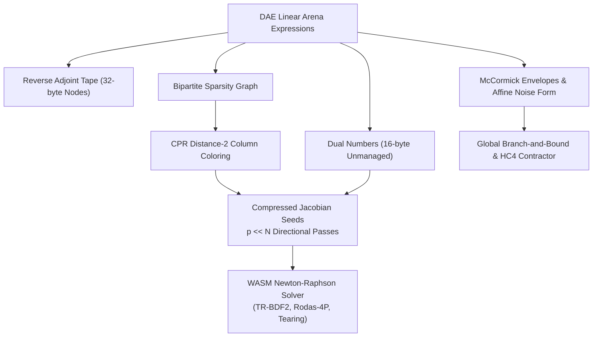

# Automatic Differentiation & Relaxations

**Implementation**:

- Forward Mode: `Dual` in [`packages/runtime/src/wasm/autodiff/dual.ts`](https://github.com/modelscript/modelscript/tree/main/packages/runtime/src/wasm/autodiff/dual.ts)
- Reverse Mode: `AdTape` in [`packages/runtime/src/wasm/autodiff/tape.ts`](https://github.com/modelscript/modelscript/tree/main/packages/runtime/src/wasm/autodiff/tape.ts)
- Sparse Jacobian Coloring: `CCSMatrix` & `ColoringEngine` in [`packages/runtime/src/wasm/autodiff/coloring.ts`](https://github.com/modelscript/modelscript/tree/main/packages/runtime/src/wasm/autodiff/coloring.ts)
- McCormick Envelopes: `McCormickTuple` in [`packages/runtime/src/wasm/autodiff/mccormick.ts`](https://github.com/modelscript/modelscript/tree/main/packages/runtime/src/wasm/autodiff/mccormick.ts)
- Affine Arithmetic: `AffineForm` in [`packages/runtime/src/wasm/autodiff/affine.ts`](https://github.com/modelscript/modelscript/tree/main/packages/runtime/src/wasm/autodiff/affine.ts)

---

## Academic Citations

### Forward-Mode Dual Numbers

- **Clifford, W. K. (1873)**. _"Preliminary sketch of biquaternions."_  
  **Proceedings of the London Mathematical Society**, 4, pp. 381–395.  
  DOI: [10.1112/plms/s1-4.1.381](https://doi.org/10.1112/plms/s1-4.1.381)
- **Study, E. (1903)**. _Geometrie der Dynamen: Die Zusammensetzung von Kräften und verwandte Gegenstände der Geometrie._ B.G. Teubner.
- **Rall, L. B. (1981)**. _Automatic Differentiation: Techniques and Applications._  
  **Lecture Notes in Computer Science**, 120, Springer.  
  DOI: [10.1007/3-540-10861-0](https://doi.org/10.1007/3-540-10861-0)

### Reverse-Mode Adjoint Accumulation (Wengert List)

- **Wengert, R. E. (1964)**. _"A simple automatic derivative evaluation program."_  
  **Communications of the ACM**, 7(8), pp. 463–464.  
  DOI: [10.1145/355586.364791](https://doi.org/10.1145/355586.364791)
- **Linnainmaa, S. (1976)**. _"Taylor expansion of the accumulated rounding error."_  
  **BIT Numerical Mathematics**, 16(2), pp. 146–160.  
  DOI: [10.1007/BF01931367](https://doi.org/10.1007/BF01931367)
- **Griewank, A., & Walther, A. (2008)**. _Evaluating Derivatives: Principles and Techniques of Algorithmic Differentiation_ (2nd ed.). SIAM.  
  ISBN: [978-0-898716-59-7](https://epubs.siam.org/doi/book/10.1137/1.9780898717761)

### Distance-2 Graph Coloring for Sparse Jacobians

- **Curtis, A. R., Powell, M. J. D., & Reid, J. K. (1974)**. _"On the estimation of sparse Jacobian matrices."_  
  **Journal of the Institute of Mathematics and Its Applications**, 13(1), pp. 117–119.  
  DOI: [10.1093/imamat/13.1.117](https://doi.org/10.1093/imamat/13.1.117) _(CPR Algorithm)_
- **Coleman, T. F., & Moré, J. J. (1983)**. _"Estimation of sparse Jacobian matrices and graph coloring problems."_  
  **SIAM Journal on Numerical Analysis**, 20(1), pp. 187–209.  
  DOI: [10.1137/0720013](https://doi.org/10.1137/0720013)
- **Gebremedhin, A. H., Manne, F., & Pothen, A. (2005)**. _"What color is your Jacobian? Graph coloring for computing derivatives."_  
  **SIAM Review**, 47(4), pp. 629–705.  
  DOI: [10.1137/S0036144504446096](https://doi.org/10.1137/S0036144504446096)

### McCormick Relaxations & Affine Arithmetic

- **McCormick, G. P. (1976)**. _"Computability of global solutions to factorable nonconvex programs: Part I—Convex underestimating problems."_  
  **Mathematical Programming**, 10(1), pp. 147–175.  
  DOI: [10.1007/BF01580665](https://doi.org/10.1007/BF01580665)
- **Mitsos, A., Chachuat, B., & Barton, P. I. (2009)**. _"McCormick-based relaxations of algorithms."_  
  **SIAM Journal on Optimization**, 20(2), pp. 573–601.  
  DOI: [10.1137/080717341](https://doi.org/10.1137/080717341)
- **Tsoukalas, A., & Mitsos, A. (2014)**. _"Multivariate McCormick relaxations."_  
  **Journal of Global Optimization**, 59(2), pp. 633–662.  
  DOI: [10.1007/s10898-014-0169-z](https://doi.org/10.1007/s10898-014-0169-z)
- **de Figueiredo, L. H., & Stolfi, J. (2004)**. _"Affine arithmetic: concepts and applications."_  
  **Numerical Algorithms**, 37(1), pp. 147–158.  
  DOI: [10.1023/B:NUMA.0000049462.70970.b6](https://doi.org/10.1023/B:NUMA.0000049462.70970.b6)

---

## ModelScript Architectural Rationale

Numerical finite-difference approximations ($\frac{f(x + h) - f(x)}{h}$) suffer from a fundamental trade-off: large step sizes $h$ cause truncation errors, while small step sizes cause catastrophic floating-point cancellation.

ModelScript implements an integrated suite of **exact differentiation and continuous bounding engines** inside WebAssembly linear memory:

1. **Forward-Mode Dual Numbers**: Computes exact machine-precision directional derivatives $\nabla f(x) \cdot v$ concurrently with primal function evaluation for Newton steps in algebraic loops and stiff ODE/DAE integrators without allocating expression trees.
2. **Reverse-Mode Computational Tape**: Evaluates scalar objective gradients $\nabla f(x) \in \mathbb{R}^N$ with cost proportional to $O(1)$ evaluations of $f$, enabling gradient-based parameter estimation and surrogate neural network training.
3. **CPR Distance-2 Graph Coloring**: For large-scale DAE systems ($N = 10{,}000+$ equations), evaluating the full $N \times N$ Jacobian naively requires $N$ forward passes. CPR distance-2 coloring partitions structural columns into $p \ll N$ non-interfering groups (typically $p \le 15$ for sparse physical networks), reducing Jacobian assembly time by orders of magnitude.
4. **McCormick Envelopes & Affine Arithmetic**: Classical interval arithmetic suffers from the **dependency problem**: evaluating $x - x$ for $x \in [0, 1]$ yields $[-1, 1]$ instead of $0$, causing rapid exponential bounding blowup. Affine arithmetic tracks first-order noise symbols ($\epsilon_i \in [-1, 1]$) across state equations, while McCormick relaxations compute rigorous convex lower bounds ($f^R$) and concave upper bounds ($f^{AR}$) for non-convex global optimization.

---

## ModelScript Modifications & WASM Architecture



### 1. Zero-GC Dual Number Arithmetic

Represented as a 16-byte unmanaged struct (`@unmanaged`) in WASM memory:

```typescript
@unmanaged
export class Dual {
  val: f64; // Primal evaluation f(x)
  dot: f64; // Directional derivative f'(x) * v
}
```

All elementary operators ($+, -, \times, /$) and transcendental functions ($\sin, \cos, \exp, \log, \text{pow}$) are inlined without intermediate object allocation.

### 2. Linear Memory Computational Tape

The reverse-mode tape records operations into a flat 32-byte stride unmanaged array:
$$\text{Stride: } [\text{op: u32}, \text{left: u32}, \text{right: u32}, \text{aux: u32}, \text{valLo: u32}, \text{valHi: u32}, \text{gradLo: u32}, \text{gradHi: u32}]$$
During the reverse pass, adjoints are accumulated in topological order directly in linear memory:
$$\bar{x}_j \leftarrow \bar{x}_j + \bar{x}_i \cdot \frac{\partial f_i}{\partial x_j}$$

### 3. CPR Distance-2 Coloring Algorithm

Two columns $j$ and $k$ in the Jacobian $J$ are **structurally orthogonal** if they do not share any non-zero row entry:
$$\text{Row}(j) \cap \text{Row}(k) = \emptyset$$
The graph coloring algorithm:

1. Constructs the bipartite graph $B = (V_R, V_C, E)$ where edge $(i, j) \in E \iff \frac{\partial f_i}{\partial x_j} \neq 0$.
2. Colors columns $V_C$ such that any pair of columns connected by a path of length 2 receives different colors.
3. Groups columns of color $c \in \{1, \dots, p\}$ into a perturbation vector $d^{(c)} = \sum_{j \in \text{Color}(c)} e_j$.
4. Computes the entire compressed Jacobian in exactly $p$ directional forward-mode passes:
   $$J \cdot d^{(c)} = \sum_{j \in \text{Color}(c)} J_{*, j}$$

### 4. McCormick Relaxations

For factorable bilinear products $z = x \cdot y$ over bounds $x \in [x^L, x^U]$ and $y \in [y^L, y^U]$, the convex underestimator $z^{cv}$ and concave overestimator $z^{cc}$ are:
$$z^{cv} = \max\left(x^L y + x y^L - x^L y^L, \; x^U y + x y^U - x^U y^U\right)$$
$$z^{cc} = \min\left(x^U y + x y^L - x^U y^L, \; x^L y + x y^U - x^L y^U\right)$$
ModelScript evaluates McCormick tuples $[z^{cv}, z^{cc}, \nabla z^{cv}, \nabla z^{cc}]$ directly on WASM arrays.

---

## Upstream & Downstream Integration

| Pipeline Component     | Upstream Dependencies                       | Downstream Consumers                                         |
| :--------------------- | :------------------------------------------ | :----------------------------------------------------------- |
| **Dual Numbers**       | `DAEBuilder` AST, Variable seed vector      | Algebraic loop tearing, Newton solvers, sensitivity analysis |
| **AdTape**             | `DAEBuilder` objective expressions          | L-BFGS-B optimizer, surrogate loss backprop                  |
| **CPR Coloring**       | Bipartite incidence matrix from `BltEngine` | Sparse Jacobian generation, SUNDIALS/TR-BDF2 linear solves   |
| **McCormick & Affine** | Bound intervals from `QueryEngine`          | HC4 contractor, Nelson-Oppen theory coordinator, SOS bounds  |
