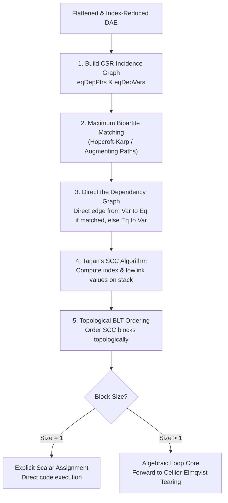

# Tarjan Block Lower Triangular (BLT) Transformation

**Implementation**: `BltEngine` in [`packages/runtime/src/wasm/structural/blt.ts`](https://github.com/modelscript/modelscript/tree/main/packages/runtime/src/wasm/structural/blt.ts)

---

## Academic Citations

- **Tarjan, R. E. (1972)**. _"Depth-first search and linear graph algorithms."_  
  **SIAM Journal on Computing**, 1(2), pp. 146–160.  
  DOI: [10.1137/0201010](https://doi.org/10.1137/0201010) (Strongly Connected Components)
- **Hopcroft, J. E., & Karp, R. M. (1973)**. _"An $n^{5/2}$ algorithm for maximum matchings in bipartite graphs."_  
  **SIAM Journal on Computing**, 2(4), pp. 225–231.  
  DOI: [10.1137/0202019](https://doi.org/10.1137/0202019) (Bipartite Matching)
- **Dulmage, A. L., & Mendelsohn, N. S. (1958)**. _"Coverings of bipartite graphs."_  
  **Canadian Journal of Mathematics**, 10, pp. 517–534.  
  DOI: [10.4153/CJM-1958-052-0](https://doi.org/10.4153/CJM-1958-052-0)
- **Cellier, F. E., & Kofman, E. (2006)**. _Continuous System Simulation_.  
  **Springer**. ISBN: [978-0-387-26102-7](https://link.springer.com/book/10.1007/0-387-30260-3)

---

## ModelScript Architectural Rationale

Flattening industrial physical systems results in coupled systems comprising thousands of equations and variables. Solving a monolithic non-linear algebraic system of size $N$ using general Newton-Raphson methods incurs a cubic computational penalty per step:

$$\mathcal{O}(N^3)$$

The Block Lower Triangular (BLT) transformation permutes the equation and variable ordering so that the incidence matrix assumes a lower triangular block diagonal structure:

$$
\begin{pmatrix}
A_{11} & 0 & \cdots & 0 \\
A_{21} & A_{22} & \cdots & 0 \\
\vdots & \vdots & \ddots & \vdots \\
A_{m1} & A_{m2} & \cdots & A_{mm}
\end{pmatrix}
\begin{pmatrix} x_1 \\ x_2 \\ \vdots \\ x_m \end{pmatrix} =
\begin{pmatrix} b_1 \\ b_2 \\ \vdots \\ b_m \end{pmatrix}
$$

Most blocks $A_{ii}$ are trivial $1 \times 1$ scalar explicit assignments ($x_i = f(\dots)$), while only non-linear algebraic loops become coupled sub-blocks of size $k \ll N$.

---

## ModelScript Modifications & WASM Architecture

1. **Compressed Sparse Row (CSR) in Linear Memory**: Bipartite incidence graphs are stored in contiguous `ChunkedInt32Array` buffers (`eqDepPtrs`, `eqDepVars`).
2. **Zero-Allocation Tarjan Traversal**: Low-link values, depth indices, and traversal stacks operate strictly on 32-bit integer offsets in WebAssembly memory without object references.
3. **Integrated Maximum Matching**: Hopcroft-Karp augmenting path search provides consistent equation-to-variable assignments for directed SCC analysis.
4. **Direct Bridge to Tearing**: SCC blocks with dimension $> 1$ pass directly to the in-WASM `TornBlock` engine.

---

## Algorithm Description & Pipeline Flow

---

## Upstream & Downstream Pipeline Connections

- **Upstream Inputs**:
  - Ingests index-reduced DAE systems from [`PantelidesEngine`](./pantelides.md).
- **Downstream Consumers**:
  - Trivial $1 \times 1$ blocks are lowered directly into sequence evaluation bytecode.
  - Coupled blocks (size $> 1$) are sent to [`TornBlock`](./tearing.md) for algebraic loop tearing.
  - Drives step evaluations in [`SUNDIALS CVODE/IDA`](./solvers-ode-dae.md) and [`Tsit5`](./solvers-ode-dae.md).
