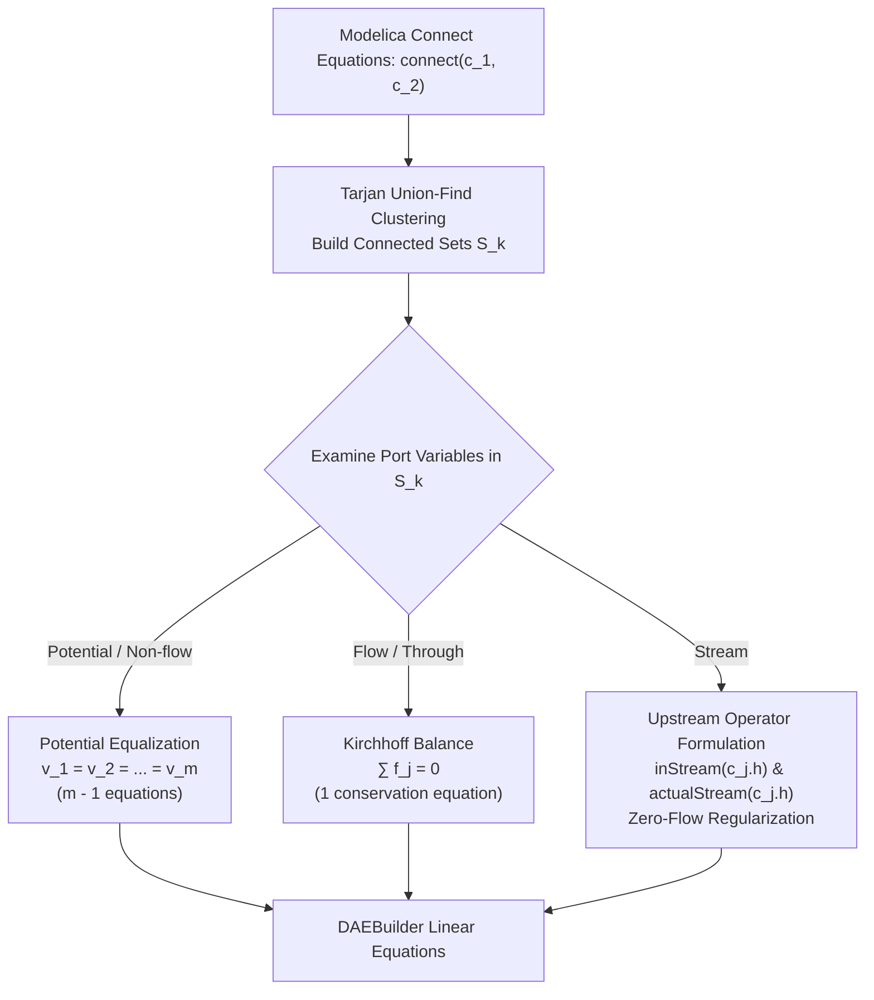

# Acausal Connector Balancing & Stream Mixing

**Implementation**: `ConnectionSetResolver` & `IntUnionFind` in [`languages/modelica/src/connections.ts`](https://github.com/modelscript/modelscript/tree/main/languages/modelica/src/connections.ts)

---

## Academic Citations

### Acausal Physical Modeling & Connection Sets

- **Mattsson, S. E., Elmqvist, H., & Otter, M. (1998)**. _"Physical system modeling with Modelica."_  
  **Control Engineering Practice**, 6(4), pp. 501–510.  
  DOI: [10.1016/S0967-0661(98)00047-1](<https://doi.org/10.1016/S0967-0661(98)00047-1>)
- **Tarjan, R. E. (1975)**. _"Efficiency of a good but not linear set union algorithm."_  
  **Journal of the ACM**, 22(2), pp. 215–225.  
  DOI: [10.1145/321879.321884](https://doi.org/10.1145/321879.321884) _(Disjoint-Set Union-Find)_

### Stream Connectors & Convective Transport

- **Franke, R., Casella, F., Otter, M., Sielemann, M., Elmqvist, H., Mattsson, S. E., & Olsson, H. (2009)**. _"Stream Connectors - An Extension of Modelica for Device-Oriented Modeling of Convective Transport."_  
  **Proceedings of the 7th Modelica Conference**, pp. 116–123.  
  DOI: [10.3384/ecp09430076](https://doi.org/10.3384/ecp09430076)

### Expandable Connectors & Multi-Domain Bus Modeling

- **Otter, M., Elmqvist, H., & Mattsson, S. E. (2005)**. _"Object-oriented modeling of bus systems with Modelica."_  
  **Proceedings of the 4th Modelica Conference**, pp. 295–308.  
  [Paper PDF](https://modelica.org/events/Conference2005/online_proceedings/Session4/Session4a2.pdf)

---

## ModelScript Architectural Rationale

Unlike classical block diagrams (such as Simulink) where connections represent directional causal signal flows ($y = f(u)$), ModelScript models **acausal physical interaction** across multi-energy domains:

- **Electrical**: Voltage $v$ (potential) and Current $i$ (flow).
- **Hydraulic & Pneumatic**: Pressure $p$ (potential) and Volume/Mass flow rate $q$ (flow).
- **Translational Mechanics**: Position/Velocity $s, v$ (potential) and Force $f$ (flow).
- **Rotational Mechanics**: Angle/Angular velocity $\phi, \omega$ (potential) and Torque $\tau$ (flow).
- **Thermal & Fluid Transport**: Temperature/Enthalpy $h$ (stream) and Heat/Mass flow $\dot{m}$ (flow).

In acausal modeling, connection statements `connect(a, b)` do not dictate computational causality. The compiler must automatically generate:

1. **Potential Equality Equations**: Enforcing that all across-variables in a connection set share an identical value.
2. **Kirchhoff Flow Equations**: Enforcing conservation of mass, charge, or energy such that all through-variables sum to zero at the junction.
3. **Convective Stream Transport Equations**: Resolving thermodynamic mixing when fluid direction reverses ($m_j \gtrless 0$) without introducing singular divisions near zero mass flow.

---

## Balancing Algorithm & Mathematical Formulation

### 1. Disjoint Connection Set Resolution (Union-Find)

The set of all declared `connect(c_a, c_b)` statements forms an undirected graph. ModelScript partitions all connector references into disjoint equivalence classes using an integer array-based Union-Find with path compression and rank heuristics:
$$\alpha(N) \le 4 \quad \text{for all physical models}$$
For each connection set $S = \{c_1, c_2, \dots, c_m\}$ of size $m$:

### 2. Potential Variable Equalization

For every non-flow, non-stream variable $v$ declared inside the connector type:
$$v(c_1) = v(c_2) = \dots = v(c_m)$$
This yields exactly $m - 1$ scalar equations. One variable is chosen as the canonical representative, eliminating $m - 1$ redundant states during alias elimination.

### 3. Kirchhoff Flow Variable Balancing

For every `flow` variable $f$ declared inside the connector type:
$$\sum_{j=1}^m f(c_j) = 0$$
This yields exactly $1$ scalar conservation equation per connection set. If an inside-outside connector hierarchy boundary is crossed, the outer flow sign is inverted to preserve directional conservation:
$$f_{\text{outer}} = \sum_{j \in \text{inner}} f(c_j)$$

### 4. Stream Variable Convective Transport

For fluid ports, transport enthalpy depends on flow direction:

$$
h_{\text{transported}} = \begin{cases}
h_{\text{upstream}} & \text{if } \dot{m} > 0 \\
h_{\text{downstream}} & \text{if } \dot{m} < 0
\end{cases}
$$

Direct formulation introduces a discontinuous switch that causes Newton solvers to oscillate around $\dot{m} = 0$. ModelScript lowers stream variables using Franke's regularized `inStream()` and `actualStream()` operators:
$$\text{inStream}(c_i.h) = \frac{\sum_{j \neq i, \dot{m}_j > 0} \dot{m}_j \cdot c_j.h}{\sum_{j \neq i, \dot{m}_j > 0} \dot{m}_j}$$
Near zero flow ($\|\dot{m}_j\| < \epsilon$), smooth polynomial regularization is applied to maintain $C^1$-continuity of the residual Jacobian.

---

## Upstream & Downstream Integration

| Pipeline Component      | Upstream Dependencies                               | Downstream Consumers                        |
| :---------------------- | :-------------------------------------------------- | :------------------------------------------ |
| **IntUnionFind**        | AST `connect` clauses from `Cst`                    | Connection set partition groups             |
| **Potential Equalizer** | Variable causality & variability from `QueryEngine` | Alias elimination (`eliminateArenaAliases`) |
| **Flow Balancer**       | Connector definitions                               | `DAEBuilder` linear equations               |
| **Stream Formulator**   | Fluid connector declarations                        | `PantelidesEngine`, Nonlinear tearing loops |
