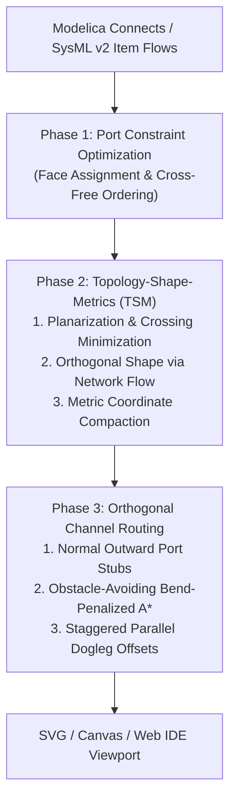

# Diagram Auto-Layout & Orthogonal Routing

**Implementation**:

- Topology-Shape-Metrics Engine: `TsmLayoutEngine` in [`packages/diagram/src/tsm-layout.ts`](https://github.com/modelscript/modelscript/tree/main/packages/diagram/src/tsm-layout.ts)
- Port Constraint & Alignment Solver: `PortIlpSolver` in [`packages/diagram/src/port-ilp-solver.ts`](https://github.com/modelscript/modelscript/tree/main/packages/diagram/src/port-ilp-solver.ts)
- Obstacle-Avoiding Channel Router: `PortRouter` in [`packages/diagram/src/port-router.ts`](https://github.com/modelscript/modelscript/tree/main/packages/diagram/src/port-router.ts)

---

## Academic Citations

### Topology-Shape-Metrics (TSM / Kandinsky) Orthogonal Layout

- **Tamassia, R. (1987)**. _"On embedding a grid graph with minimum number of bends."_  
  **SIAM Journal on Computing**, 16(3), pp. 421–444.  
  DOI: [10.1137/0216030](https://doi.org/10.1137/0216030)
- **Fößmeier, U., & Kaufmann, M. (1996)**. _"Drawing high-degree graphs with minimum number of bends."_  
  **Graph Drawing (GD '95)**, Lecture Notes in Computer Science, 1027, pp. 211–225. Springer.  
  DOI: [10.1007/BFb0021804](https://doi.org/10.1007/BFb0021804)
- **Di Battista, G., Eades, P., Tamassia, R., & Tollis, I. G. (1998)**. _Graph Drawing: Algorithms for the Visualization of Graphs._ Prentice Hall.  
  ISBN: [0-13-301615-3](https://dl.acm.org/doi/book/10.5555/289569)

### Port Constraint & Continuous Alignment ILP

- **Spönemann, M., von Hanxleden, R., & Fuhrmann, H. (2014)**. _"Port constraints in layout algorithms."_  
  **Graph Drawing (GD 2014)**, Lecture Notes in Computer Science, 8871, pp. 351–362. Springer.  
  DOI: [10.1007/978-3-662-45803-7_29](https://doi.org/10.1007/978-3-662-45803-7_29)
- **Kieffer, S., Dwyer, T., Marriott, K., & Wybrow, M. (2016)**. _"Incremental layout for dynamic schematic diagrams."_  
  **IEEE Transactions on Visualization and Computer Graphics**, 22(1), pp. 876–885.  
  DOI: [10.1109/TVCG.2015.2467364](https://doi.org/10.1109/TVCG.2015.2467364)
- **Eiglsperger, M., Fößmeier, U., & Kaufmann, M. (2001)**. _"Orthogonal graph drawing with constraints."_  
  **Journal of Graph Algorithms and Applications**, 5(2), pp. 1–24.  
  DOI: [10.7155/jgaa.00035](https://doi.org/10.7155/jgaa.00035)

### Orthogonal Channel Routing & Obstacle Avoidance

- **Lee, C. Y. (1961)**. _"An algorithm for path connection and its applications."_  
  **IRE Transactions on Electronic Computers**, EC-10(3), pp. 346–365.  
  DOI: [10.1109/TEC.1961.5219222](https://doi.org/10.1109/TEC.1961.5219222)
- **Hart, P. E., Nilsson, N. J., & Raphael, B. (1968)**. _"A formal basis for the heuristic determination of minimum cost paths."_  
  **IEEE Transactions on Systems Science and Cybernetics**, 4(2), pp. 100–107.  
  DOI: [10.1109/TSSC.1968.300136](https://doi.org/10.1109/TSSC.1968.300136) _(A\* Search)_
- **Deutsch, D. N. (1976)**. _"A 'dogleg' channel router."_  
  **Proceedings of the 13th Design Automation Conference (DAC '76)**, pp. 425–433.  
  DOI: [10.1145/800263.810688](https://doi.org/10.1145/800263.810688)

---

## ModelScript Architectural Rationale

Physical engineering schematics (such as Modelica connection diagrams, SysML v2 Internal Block Diagrams, and hydraulic/piping schematics) require strict geometric conventions:

- **Orthogonal Edges**: Connections must run strictly along horizontal and vertical channels with clean $90^\circ$ bends.
- **Port-Constraint Preservation**: High-degree engineering components have physical boundary pins (e.g. electrical resistors have pins $p$ and $n$ on opposite faces; hydraulic valves have ports $A$, $B$, $P$, $T$). Layout engines must place connection points on explicit component boundaries rather than abstract node centers.
- **Zero-Obstacle Penetration**: Wires must never traverse component bounding boxes.
- **Bus Disambiguation**: Multi-variable connections between blocks must not collapse onto identical collinear segments.

ModelScript implements the **Topology-Shape-Metrics (TSM)** pipeline augmented with a **Global Port ILP Solver** and **Dogleg Channel Router** natively in the browser and CLI.

---

## Three-Phase Layout & Routing Architecture

### 1. Port Constraint & Continuous Alignment Solver

Resolves port assignment along component perimeters ($x, y \in \partial \text{Node}$):

- **Discrete Face Selection**: Assigns ports to Cardinal sides (`top`, `bottom`, `left`, `right`) minimizing Manhattan connection distance:
  $$\min \sum_{e = (u_i, v_j) \in E} \| \mathbf{p}(u_i) - \mathbf{p}(v_j) \|_1$$
- **Causality Biasing**: Automatically places `input` ports on the left face and `output` ports on the right face for signal-flow blocks.
- **Collinear Port Snapping**: Enforces 0-bend straight lines whenever two connected ports are horizontally or vertically aligned within a configurable tolerance `straightTolerance`.

### 2. Topology-Shape-Metrics (TSM) Engine

Extends Tamassia's Kandinsky model for high-degree engineering vertices:

1. **Planarization**: Replaces unavoidable edge crossings with dummy vertices of degree 4.
2. **Orthogonalization (Minimum Bend Flow)**: Formulates bend minimization as a minimum-cost network flow problem over the dual graph, assigning angles $\alpha \in \{90^\circ, 180^\circ, 270^\circ, 360^\circ\}$ to faces.
3. **Compaction**: Solves two independent 1D longest path problems on horizontal and vertical constraint DAGs to compute minimal integer grid coordinates.

### 3. Obstacle-Avoiding Dogleg Channel Router

Renders clean multi-segment connection polylines:

- **Perpendicular Port Stubs**: Edge paths extend outward along the port normal vector by a distance `stubLength` before turning.
- **A\* Grid Search with Bend Penalty**: Avoids component AABB bounding boxes using fast `segmentIntersectsRect` intersection tests while penalizing unnecessary turns:
  $$\text{Cost}(p \to q) = \text{dist}(p, q) + \lambda_{\text{bend}} \cdot [\text{isTurn}(p, q)]$$
- **Staggered Parallel Channels**: Multi-wire bus connections share a common corridor but are offset by `parallelIndex * channelSpacing`, preventing overlapping lines.

---

## Upstream & Downstream Integration

| Pipeline Component  | Upstream Dependencies                                   | Downstream Consumers                                 |
| :------------------ | :------------------------------------------------------ | :--------------------------------------------------- |
| **PortIlpSolver**   | `SymbolIndex` connector ports, `Annotation` constraints | Port placement in `TsmLayoutEngine`                  |
| **TsmLayoutEngine** | Polyglot connect graphs (Modelica, SysML v2)            | Node bounding box placement, routing channels        |
| **PortRouter**      | Component layout coordinates, Port locations            | SVG polyline rendering, interactive 3D/2D IDE canvas |
