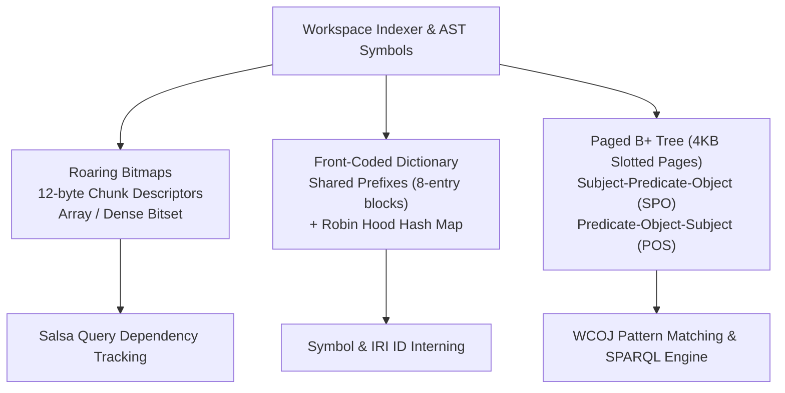

# Linear Memory Structures & Indexing

**Implementation**:

- Roaring Bitmaps: `RoaringBitmap` in [`packages/runtime/src/wasm/core/roaring.ts`](https://github.com/modelscript/modelscript/tree/main/packages/runtime/src/wasm/core/roaring.ts)
- Front-Coded IRI Dictionary: `FrontCodedDictionary` in [`packages/runtime/src/wasm/core/trie.ts`](https://github.com/modelscript/modelscript/tree/main/packages/runtime/src/wasm/core/trie.ts)
- Slotted Page B+ Tree: `PagedBTree` in [`packages/runtime/src/wasm/storage/paged_btree.ts`](https://github.com/modelscript/modelscript/tree/main/packages/runtime/src/wasm/storage/paged_btree.ts)

---

## Academic Citations

### Compressed Roaring Bitmaps

- **Chambi, S., Lemire, D., Kaser, O., & Godin, R. (2016)**. _"Better bitmap performance with Roaring bitmaps."_  
  **Software: Practice and Experience**, 46(5), pp. 709–719.  
  DOI: [10.1002/spe.2325](https://doi.org/10.1002/spe.2325)
- **Lemire, D., Ssi-Yan-Kai, G., & Kaser, O. (2018)**. _"Consistently faster and smaller compressed bitmaps with Roaring."_  
  **Software: Practice and Experience**, 48(9), pp. 1615–1638.  
  DOI: [10.1002/spe.2560](https://doi.org/10.1002/spe.2560)

### Front-Coded String & IRI Compression

- **Witten, I. H., Moffat, A., & Bell, T. C. (1999)**. _Managing Gigabytes: Compressing and Indexing Documents and Images_ (2nd ed.). Morgan Kaufmann.  
  ISBN: [1-55860-570-3](https://dl.acm.org/doi/book/10.5555/553876)
- **Martínez-Prieto, M. A., Fernández, J. D., & Cánovas, R. (2012)**. _"Compression of RDF Dictionaries."_  
  **ACM Transactions on the Web (TWEB)**, 6(4), pp. 1–35.  
  DOI: [10.1145/2382636.2382639](https://doi.org/10.1145/2382636.2382639)
- **Brisaboa, N. R., Cánovas, R., Francisco, C. C., Martínez-Prieto, M. A., & Navarro, G. (2011)**. _"K2-trees for compact Web graph representation."_  
  **Information Systems**, 39, pp. 152–163.  
  DOI: [10.1016/j.is.2012.08.003](https://doi.org/10.1016/j.is.2012.08.003)

### Slotted Page B+ Tree & SPO Triple Storage

- **Bayer, R., & McCreight, E. (1972)**. _"Organization and maintenance of large ordered indexes."_  
  **Acta Informatica**, 1(3), pp. 173–189.  
  DOI: [10.1007/BF00288683](https://doi.org/10.1007/BF00288683)
- **Comer, D. (1979)**. _"The ubiquitous B-tree."_  
  **ACM Computing Surveys**, 11(2), pp. 121–137.  
  DOI: [10.1145/356770.356776](https://doi.org/10.1145/356770.356776)
- **Mohan, C., Haderle, D., Lindsay, B., Pirahesh, H., & Schwarz, P. (1992)**. _"ARIES: A transaction recovery method supporting fine-granularity locking and partial rollbacks using write-ahead logging."_  
  **ACM Transactions on Database Systems**, 17(1), pp. 94–162.  
  DOI: [10.1145/128765.128770](https://doi.org/10.1145/128765.128770)
- **Neumann, T., & Weikum, G. (2008)**. _"RDF-3X: A RISC-style engine for RDF."_  
  **Proceedings of the VLDB Endowment**, 1(1), pp. 647–659.  
  DOI: [10.14778/1453856.1453927](https://doi.org/10.14778/1453856.1453927)

---

## ModelScript Architectural Rationale

ModelScript compiles and indexes multi-million-element engineering workspaces, including the complete Modelica Standard Library (MSL), SysML v2 standard libraries (KerML), ISO 10303 STEP schemata, and OWL2 domain ontologies.

Representing these vast semantic graphs using standard JavaScript object heaps incurs:

- Extreme memory bloat (JavaScript objects typically consume 40–80 bytes of overhead per node).
- Heavy Garbage Collector (GC) pressure and unpredictable pause times during interactive IDE editing.
- Slow pointer chasing across cache lines.

To solve this, ModelScript implements **compact, zero-GC data structures** operating directly inside WebAssembly 64-bit linear memory.

---

## Architecture of Core WASM Structures



### 1. Unmanaged Roaring Bitmaps

Partitions the 32-bit integer space into $2^{16} = 65{,}536$ chunks based on the upper 16 bits:

- **12-Byte Chunk Descriptor**:
  ```
  Offset 0..3:   [key: u16] | [containerType: u16]
  Offset 4..7:   [containerPtr: u32]
  Offset 8..9:   [cardinality: u16]
  Offset 10..11: [capacity: u16]
  ```
- **Adaptive Containers**:
  - **Array Container**: Used when cardinality $< 4{,}096$. Elements are stored as sorted `u16` integers in linear memory.
  - **Bitmap Container**: When cardinality reaches $4{,}096$, the container automatically converts to a dense 8,192-byte bitset ($1{,}024 \times \text{u64}$ words), allowing bitwise `AND`, `OR`, `XOR` operations at hardware SIMD speeds.

### 2. Front-Coded String & IRI Dictionary

Engineering identifiers and semantic URIs often share massive common prefixes:

```
http://modelscript.io/sysml2/core#PartDefinition
http://modelscript.io/sysml2/core#ItemDefinition
http://modelscript.io/sysml2/core#ActionDefinition
```

The front-coded dictionary partitions sorted strings into blocks of size $K = 8$:

- **Header String**: Stored uncompressed at the beginning of each block.
- **Suffix Entries**: Encoded as `[commonPrefixLen: u8, suffixLen: u8, suffixBytes]`.
- **Hybrid Lookups**: Combines front-coding (achieving 75–85% memory compression) with a zero-cost 64-bit Robin Hood hash map (`UnmanagedMap64`) for $O(1)$ string-to-ID interning.

### 3. Paged 4KB Slotted B+ Tree

Stores billions of semantic assertions and relational tuples:

- **4KB Slotted Page Layout (32-byte header + 254 entries)**:
  ```
  [0..3]   pageId: u32
  [4..5]   pageType: u16 (1 = Leaf, 2 = Internal)
  [6..7]   itemCount: u16
  [8..11]  prevPage: u32 (doubly-linked leaf chain for range scans)
  [12..15] nextPage: u32
  [16..19] parentPage: u32
  [20..23] flags: u32
  [24..31] lsn: u64 (Log Sequence Number for crash consistency)
  ```
- **RDF-3X Triples**: Triples $(S, P, O)$ are indexed in clustered B+ tree leaf chains. Full index permutations (`SPO`, `POS`, `OSP`) permit fast range scans for multi-way graph joins without intermediate hash joins.

---

## Upstream & Downstream Integration

| Data Structure           | Upstream Dependencies                      | Downstream Consumers                                     |
| :----------------------- | :----------------------------------------- | :------------------------------------------------------- |
| **RoaringBitmap**        | Symbol IDs from `SymbolIndexer`            | Invalidation sets in `QueryEngine`, type sets            |
| **FrontCodedDictionary** | AST string literals, Qualified names, URIs | Inter-file symbol resolution, memory-mapped LSP indexing |
| **PagedBTree**           | AST semantic relationships, OWL2 axioms    | Leapfrog Triejoin (WCOJ), graph query evaluators, SPARQL |
