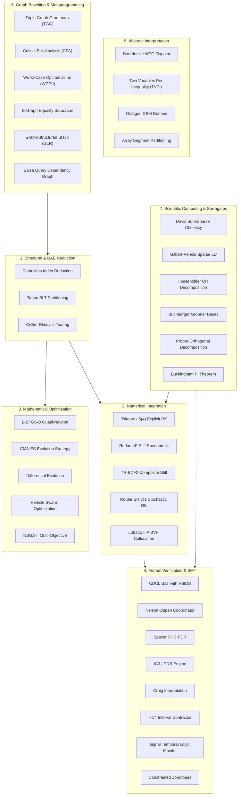

# ModelScript Algorithms Catalog

ModelScript is powered by a comprehensive foundation of peer-reviewed mathematical, compiler, and formal verification algorithms. Rather than relying on opaque external black boxes, ModelScript implements these algorithms natively in WebAssembly and TypeScript, with inline citations, architectural rationales, and explicit tracking of upstream inputs and downstream consumers.

---

## Computational Map

The algorithms catalog spans seven core domains across the compilation, simulation, and verification pipelines:

---

## Algorithm Directory

| Category                     | Primary Algorithms                                                                                        | Implementation Package                                               |
| :--------------------------- | :-------------------------------------------------------------------------------------------------------- | :------------------------------------------------------------------- |
| **Structural DAE**           | [Pantelides Algorithm](./pantelides.md), [Tarjan BLT](./blt.md), [Cellier-Elmqvist Tearing](./tearing.md) | `@modelscript/runtime`                                               |
| **Acausal Balancing**        | [Acausal Potential Equalization, Kirchhoff Flows, Stream Mixing](./connector-balancing.md)                | `@modelscript/modelica`                                              |
| **Autodiff & Relaxations**   | [Dual Numbers, AdTape, CPR Graph Coloring, McCormick, Affine](./autodiff.md)                              | `@modelscript/runtime`                                               |
| **Numerical Solvers**        | [Tsit5, Rodas-4P, TR-BDF2, SDE, BVP](./solvers-ode-dae.md)                                                | `@modelscript/simulate`                                              |
| **Optimization**             | [L-BFGS-B, CMA-ES, Differential Evolution, PSO, NSGA-II](./optimization.md)                               | `@modelscript/simulate`                                              |
| **SMT & Verification**       | [Nelson-Oppen, CDCL SAT, Craig Interpolation, HC4, STL, Zonotopes](./theory-coordinator.md)               | `@modelscript/runtime/formal`                                        |
| **Model Checking**           | [Spacer CHC PDR & IC3 Engine](./verification-chc.md)                                                      | `@modelscript/runtime/formal`                                        |
| **Abstract Interpretation**  | [WTO Fixpoint, TVPI, Octagon DBM, Array Segments](./abstract-interpretation.md)                           | `@modelscript/runtime/formal`                                        |
| **Graph Rewriting**          | [Triple Graph Grammars, CPA, WCOJ, E-Graphs, GSS, Salsa](./graph-rewriting.md)                            | `@modelscript/dsl`                                                   |
| **Linear Memory Structures** | [Roaring Bitmaps, Front-Coded Dictionary, Paged B+ Tree](./linear-memory-structures.md)                   | `@modelscript/runtime`                                               |
| **Scientific Computing**     | [Sparse Cholesky, Sparse LU, Householder QR, Gröbner, POD, Buckingham Pi](./surrogates-linear-algebra.md) | `@modelscript/runtime` & `@modelscript/simulate`                     |
| **SDP, BVP & CAD**           | [Primal-Dual SDP, Multiple Shooting BVP, CSG & CFD Patches](./sdp-bvp-cad.md)                             | `@modelscript/runtime`, `@modelscript/simulate` & `@modelscript/cad` |
| **Diagram Layout**           | [Tamassia TSM, Port ILP Solver, Dogleg Channel Router](./diagram-layout.md)                               | `@modelscript/diagram`                                               |
