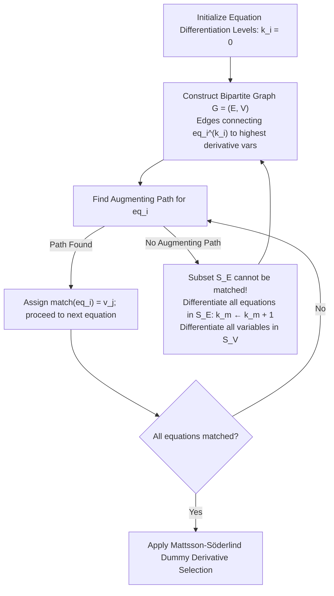

# Pantelides Structural Index Reduction

**Implementation**: `PantelidesEngine` in [`packages/runtime/src/wasm/structural/pantelides.ts`](https://github.com/modelscript/modelscript/tree/main/packages/runtime/src/wasm/structural/pantelides.ts)

---

## Academic Citations

- **Pantelides, C. C. (1988)**. _"The consistent initialization of differential-algebraic systems."_  
  **SIAM Journal on Scientific and Statistical Computing**, 9(2), pp. 213–231.  
  DOI: [10.1137/0909014](https://doi.org/10.1137/0909014)
- **Mattsson, S. E., & Söderlind, G. (1993)**. _"Index reduction in differential-algebraic equations using dummy derivatives."_  
  **SIAM Journal on Scientific Computing**, 14(3), pp. 677–692.  
  DOI: [10.1137/0914043](https://doi.org/10.1137/0914043)

---

## ModelScript Architectural Rationale

Object-oriented multi-domain physical models (such as constrained multi-body mechanics, closed kinematic linkages, and incompressible hydraulic loops) inherently generate high-index Differential-Algebraic Equations (DAEs) where the differential index satisfies $\text{ind} \ge 2$:

$$F(t, x, \dot{x}, y) = 0$$

Standard numerical integrators (including BDF, Radau, and Runge-Kutta methods) become severely ill-conditioned or fail to converge on systems with differential index greater than 1.

Pantelides' algorithm identifies minimally singular subsets of equations and differentiates them analytically with respect to time until an index-1 or index-0 formulation is attained. To prevent over-determination and numerical drift along algebraic constraint manifolds, the Mattsson-Söderlind dummy derivative method dynamically replaces redundant derivative states with algebraic placeholders.

---

## ModelScript Modifications & WASM Architecture

1. **In-WASM Linear Memory Execution**: Operates as an unmanaged WebAssembly kernel (`@unmanaged`) with zero garbage collection allocations.
2. **Direct Arena Symbolic Differentiation**: Derivatives of equations ($\frac{d^k f}{dt^k} = 0$) are differentiated directly on `DAEBuilder` linear expression nodes in memory.
3. **Flat Chunked Arrays**: Equation dependency incidence pointers, differentiation levels, and matching arrays are stored in flat `ChunkedInt32Array` buffers.
4. **Augmenting Path Bipartite Matching**: Alternating path searches run directly over highest-derivative variables, seamlessly transferring matching data to the downstream `BltEngine`.

---

## Algorithm Description & Mathematics

### Mathematical Steps

1. **Variable Classification**: Identify highest-order derivatives $\dot{x}_j$ and purely algebraic variables $y_k$.
2. **Alternating Augmenting Paths**: For each equation $f_i = 0$, attempt to find an augmenting path in the bipartite incidence graph to an unmatched highest-order derivative.
3. **Index Reduction by Differentiation**: If no augmenting path exists, the reachable set of equations $S_E$ is structurally singular. Increment the differentiation index $k_m \leftarrow k_m + 1$ for all $f_m \in S_E$, symbolically compute $\frac{d f_m}{dt}$, and repeat the matching.
4. **Dummy Derivatives**: For each differentiated state variable where both $x_j$ and $\dot{x}_j$ appear in algebraic constraints, select a dummy algebraic variable $x_{j,\text{dummy}}$ to replace $\dot{x}_j$, preserving degrees of freedom.

---

## Upstream & Downstream Pipeline Connections

- **Upstream Inputs**:
  - Ingests the flat DAE representation from `DAEBuilder` produced by [`ModelicaFlattener`](../architecture/dae-arena.md).
  - Uses `Cst` linear nodes for symbolic expressions.
- **Downstream Consumers**:
  - Feeds the index-reduced DAE directly into [`BltEngine`](./blt.md) for block lower triangular partitioning.
  - Determines consistent initial conditions for [`SUNDIALS IDA`](./solvers-ode-dae.md) and [`TR-BDF2`](./solvers-ode-dae.md).
