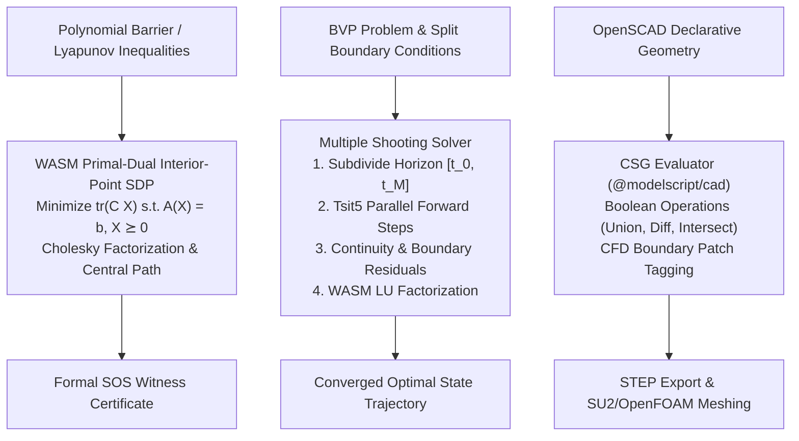

# Semidefinite Programming, BVP & Geometric CSG

**Implementation**:

- Primal-Dual Interior-Point SDP: `SdpSolver` in [`packages/runtime/src/solvers/wasm_sdp_solver.ts`](https://github.com/modelscript/modelscript/tree/main/packages/runtime/src/solvers/wasm_sdp_solver.ts)
- Multiple Shooting & Collocation BVP: `solveBvpShooting` in [`packages/simulate/src/solvers/bvp-solver.ts`](https://github.com/modelscript/modelscript/tree/main/packages/simulate/src/solvers/bvp-solver.ts)
- Constructive Solid Geometry & CFD Patches: `evaluateScad` in [`languages/scad/src/evaluator.ts`](https://github.com/modelscript/modelscript/tree/main/languages/scad/src/evaluator.ts)

---

## Academic Citations

### Semidefinite Programming & Sum-of-Squares (SOS)

- **Vandenberghe, L., & Boyd, S. (1996)**. _"Semidefinite Programming."_  
  **SIAM Review**, 38(1), pp. 49–95.  
  DOI: [10.1137/1038003](https://doi.org/10.1137/1038003)
- **Helmberg, C., Rendl, F., Vanderbei, R. J., & Wolkowicz, H. (1996)**. _"An interior-point method for semidefinite programming."_  
  **SIAM Journal on Optimization**, 6(2), pp. 342–361.  
  DOI: [10.1137/0806018](https://doi.org/10.1137/0806018)
- **Alizadeh, F., Haeberly, J. P. A., & Overton, M. L. (1998)**. _"Primal-dual interior-point methods for semidefinite programming: convergence rates, stability and numerical results."_  
  **SIAM Journal on Optimization**, 8(3), pp. 746–768.  
  DOI: [10.1137/S105262349528701X](https://doi.org/10.1137/S105262349528701X)
- **Parrilo, P. A. (2003)**. _"Semidefinite programming relaxations for semialgebraic problems."_  
  **Mathematical Programming**, 96(2), pp. 293–320.  
  DOI: [10.1007/s10107-003-0387-5](https://doi.org/10.1007/s10107-003-0387-5) _(SOS Programming)_

### Boundary Value Problems (BVP) & Multiple Shooting

- **Morrison, D. D., Riley, J. D., & Zancanaro, J. F. (1962)**. _"Multiple shooting method for two-point boundary value problems."_  
  **Communications of the ACM**, 5(12), pp. 613–614.  
  DOI: [10.1145/368996.369028](https://doi.org/10.1145/368996.369028)
- **Stoer, J., & Bulirsch, R. (2002)**. _Introduction to Numerical Analysis_ (3rd ed.). Texts in Applied Mathematics 12, Springer. Section 7.3: Multiple Shooting Methods.  
  ISBN: [978-0-387-95452-3](https://link.springer.com/book/10.1007/978-0-387-21738-3)
- **Ascher, U. M., Mattheij, R. M., & Russell, R. D. (1995)**. _Numerical Solution of Boundary Value Problems for Ordinary Differential Equations._  
  SIAM Classics in Applied Mathematics 13.  
  DOI: [10.1137/1.9781611971231](https://doi.org/10.1137/1.9781611971231)
- **Betts, J. T. (2010)**. _Practical Methods for Optimal Control and Estimation Using Nonlinear Programming_ (2nd ed.).  
  SIAM Advances in Design and Control 19.  
  DOI: [10.1137/1.9780898718577](https://doi.org/10.1137/1.9780898718577)

### Constructive Solid Geometry (CSG)

- **Requicha, A. A. (1980)**. _"Representations for rigid solids: Theory, methods, and systems."_  
  **ACM Computing Surveys**, 12(4), pp. 437–464.  
  DOI: [10.1145/356827.356833](https://doi.org/10.1145/356827.356833)
- **Foley, J. D., Van Dam, A., Feiner, S. K., & Hughes, J. F. (1996)**. _Computer Graphics: Principles and Practice_ (2nd ed.). Addison-Wesley. Chapter 12: Constructive Solid Geometry.  
  ISBN: [0-201-84840-6](https://dl.acm.org/doi/book/10.5555/234552)
- **Kienzle, M. (2009)**. _OpenSCAD: The Programmers Solid 3D CAD Modeller._  
  [https://openscad.org](https://openscad.org)

---

## ModelScript Architectural Rationale

1. **Semidefinite Programming (SDP) for Verified Safety**: Formal continuous verification of non-linear physical models requires proving that state trajectories $\mathbf{x}(t)$ never breach unsafe operating envelopes. Synthesizing polynomial Lyapunov functions $V(\mathbf{x}) > 0$ and barrier certificates $B(\mathbf{x}) \le 0$ reduces to finding Sum-of-Squares (SOS) decompositions:
   $$p(\mathbf{x}) = \mathbf{z}(\mathbf{x})^T Q \, \mathbf{z}(\mathbf{x}) \ge 0 \iff Q \succeq 0$$
   By implementing a native primal-dual interior-point SDP solver in WebAssembly, ModelScript provides mathematically verified stability proofs directly in the browser and CLI without relying on external monolithic commercial solvers.
2. **Multiple Shooting BVP for Optimal Trajectories**: Boundary Value Problems (BVPs) govern optimal trajectory planning, model predictive control (MPC), and periodic limit cycle detection with split boundary conditions:
   $$g(\mathbf{y}(t_0), \mathbf{y}(t_{\text{end}}), \mathbf{p}) = \mathbf{0}$$
   Standard single shooting suffers from catastrophic numerical instability on stiff or chaotic dynamics. Multiple shooting subdivides the time horizon into $M$ subintervals, guaranteeing numerical stability and fast Newton-Raphson convergence.
3. **Constructive Solid Geometry (CSG) for Multi-Physics 3D Packaging**: Lumped-parameter 1D physical models (Modelica) rely on 3D geometric properties (mass, inertia tensor, aerodynamic drag area, hydraulic volume). ModelScript evaluates OpenSCAD models into normalized CSG solid trees (`@modelscript/cad`), auto-tagging boundary patches (`inlet`, `outlet`, `wall`, `symmetry`) for downstream OpenCascade B-Rep evaluation, STEP export, and SU2/OpenFOAM CFD meshing.

---

## Mathematical Formulation & Execution Architecture

### 1. Primal-Dual Interior Point SDP Solver

Solves standard primal and dual semidefinite programs:
$$\text{Primal: } \min_{X \in \mathbb{S}^n} \text{tr}(C X) \quad \text{s.t.} \quad \text{tr}(A_i X) = b_i, \; X \succeq 0$$
$$\text{Dual: } \max_{y \in \mathbb{R}^m, S \in \mathbb{S}^n} b^T y \quad \text{s.t.} \quad \sum_{i=1}^m y_i A_i + S = C, \; S \succeq 0$$

- **Central Path Following**: Enforces the perturbed complementarity condition $X S = \mu I$ with barrier parameter $\mu = \frac{\text{tr}(X S)}{n}$.
- **WASM Linear Algebra**: Predictor-corrector search directions $(\Delta X, \Delta y, \Delta S)$ are computed using fast in-memory Cholesky factorizations (`wasm_gaussian.ts`), with backtracking line search to ensure $X + \alpha \Delta X \succ 0$ and $S + \alpha \Delta S \succ 0$.

### 2. Multiple Shooting BVP Solver

Subdivides the horizon $[t_0, t_{\text{end}}]$ into $M$ subintervals with mesh points $t_0 < t_1 < \dots < t_M = t_{\text{end}}$:

- **State Trajectory Variables**: Introduces free initial conditions $\mathbf{s}_m$ at each node $t_m$.
- **Subinterval Integration**: Integrates forward from $t_m$ to $t_{m+1}$ using adaptive `tsit5`:
  $$\mathbf{y}(t_{m+1}; \mathbf{s}_m, \mathbf{p})$$
- **Matching Residual System**: Solves the $(M \cdot n + k) \times (M \cdot n + k)$ simultaneous nonlinear system:
  $$F_m(\mathbf{s}_m, \mathbf{s}_{m+1}) = \mathbf{y}(t_{m+1}; \mathbf{s}_m, \mathbf{p}) - \mathbf{s}_{m+1} = \mathbf{0}, \quad m = 0, \dots, M-1$$
  $$g(\mathbf{s}_0, \mathbf{s}_M, \mathbf{p}) = \mathbf{0}$$
- **Newton-Raphson Update**: Evaluates sensitivity Jacobians along trajectories and solves the block-banded linear system via WASM Gaussian LU elimination.

### 3. OpenSCAD CSG Engine & CFD Boundary Tagging

Transforms procedural CSG trees into boundary-tagged solid geometries:

- Evaluates transformations (`translate`, `rotate`, `scale`, `mirror`) and regularized Boolean operators (`union`, `difference`, `intersection`).
- Decorates faces with CFD boundary tags (`tagPatch`, `BoundaryPatchType`: `inlet`, `outlet`, `wall`, `symmetry`), enabling seamless handoff to automated SU2 mesh generators.

---

## Upstream & Downstream Integration

| Component         | Upstream Dependencies                                | Downstream Consumers                                    |
| :---------------- | :--------------------------------------------------- | :------------------------------------------------------ |
| **SdpSolver**     | Polynomial constraints from `TheoryCoordinator`      | Formal Lyapunov barrier certificates, safety proofs     |
| **BvpSolver**     | ODE dynamics from `DaeBuilder`, split boundary specs | Model predictive control (MPC), trajectory optimization |
| **ScadEvaluator** | Declarative `.scad` ASTs, Modelica parameters        | OpenCascade B-Rep kernels, STEP CAD export, CFD meshing |
