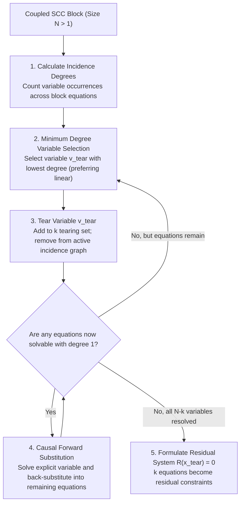

# Cellier-Elmqvist Algebraic Loop Tearing

**Implementation**: `TornBlock` in [`packages/runtime/src/wasm/structural/tearing.ts`](https://github.com/modelscript/modelscript/tree/main/packages/runtime/src/wasm/structural/tearing.ts)

---

## Academic Citations

- **Cellier, F. E. (1979)**. _Combined Continuous/Discrete System Simulation by Use of Digital Computers: Techniques and Tools_.  
  **PhD thesis, ETH Zurich**.  
  DOI: [10.3929/ethz-a-000179979](https://doi.org/10.3929/ethz-a-000179979)
- **Elmqvist, H., & Otter, M. (1994)**. _"Methods for Tearing Systems of Equations in Object-Oriented Modeling."_  
  **Proceedings of the European Simulation Multiconference (ESM'94)**, pp. 326–332.
- **Mahana, P. N., & Eagan, J. P. (1975)**. _"A tearing algorithm for large systems of equations."_  
  **IEEE Transactions on Circuits and Systems**.

---

## ModelScript Architectural Rationale

Even after BLT partitioning, physical systems containing closed kinematic loops, electrical bridge circuits, or multi-phase fluid balances yield coupled Strongly Connected Components of size $N > 1$.

Solving an $N$-dimensional non-linear system via Newton-Raphson requires inverting an $N \times N$ Jacobian matrix at every iteration:

$$\mathcal{O}(N^3)$$

The Cellier-Elmqvist Minimum Degree Tearing algorithm identifies a minimal set of $k$ **tearing variables** ($k \ll N$) such that assuming known values for these $k$ variables breaks all cyclic dependencies in the block. The remaining $N - k$ inner variables can then be evaluated sequentially via a causal explicit forward substitution chain:

$$
\begin{aligned}
x_{\text{inner}} &= g(x_{\text{tear}}, u) \quad \text{(explicit chain)} \\
R(x_{\text{tear}}) &= f_{\text{residual}}(x_{\text{tear}}, x_{\text{inner}}) = 0 \quad \text{(small $k \times k$ solve)}
\end{aligned}
$$

The non-linear iterative solver is restricted to the tiny $k \times k$ residual system, accelerating simulation speed by orders of magnitude.

---

## ModelScript Modifications & WASM Architecture

1. **Unmanaged WebAssembly Kernel**: Implemented as `@unmanaged` classes directly in linear memory with zero garbage collection pauses.
2. **Dynamic Minimum Degree Heuristic**: Evaluates vertex degrees in the block incidence graph in memory, prioritizing linear tearing variables over non-linear variables to avoid non-linear solving where possible.
3. **Partitioned In-Memory Structures**: Splits the block into:
   - $k$ tearing variables (`tearVarIndices`)
   - $N - k$ explicit causal equations (`innerEqIndices`)
   - $k$ residual constraint equations (`residualEqIndices`)
4. **Direct Matrix Integration**: Emits residual Jacobians directly to the in-WASM LU factorizer (`luFactor`, `luSolve`).

---

## Algorithm Steps

---

## Upstream & Downstream Pipeline Connections

- **Upstream Inputs**:
  - Receives coupled SCC blocks of size $> 1$ from [`BltEngine`](./blt.md).
- **Downstream Consumers**:
  - Feeds explicit forward chains and $k \times k$ residual systems to the in-WASM Newton-Raphson solver and [`Sparse LU Solver`](./surrogates-linear-algebra.md).
  - Evaluated inside simulation step loops ([`SUNDIALS`](./solvers-ode-dae.md), [`TR-BDF2`](./solvers-ode-dae.md), [`Tsit5`](./solvers-ode-dae.md)).
