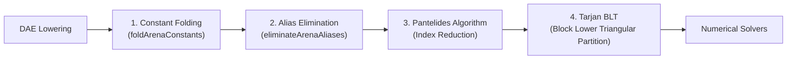

# Linear Memory DAE Arena & Lowering

The Differential Algebraic Equations (DAE) representation in ModelScript is implemented via `DAEBuilder` in `@modelscript/runtime` (`packages/runtime/src/dae/wasm_dae.ts`).

Unlike traditional compilers that construct linked expression trees using heap-allocated objects, `DAEBuilder` operates strictly on **flat, contiguous typed arrays** (Struct-of-Arrays) in WebAssembly linear memory.

---

## Arena Struct-of-Arrays (SoA) Layout

The arena maintains three primary contiguous arrays:

```
┌───────────────────────────────────────────────────────────────────┐
│                      DAEBuilder Linear Memory                     │
├─────────────────┬──────────────────┬──────────────────────────────┤
│ Buffer          │ Element Size     │ Contents                     │
├─────────────────┼──────────────────┼──────────────────────────────┤
│ varData         │ 32 bytes         │ Name, type, variability,     │
│                 │                  │ causality, start value, flags│
├─────────────────┼──────────────────┼──────────────────────────────┤
│ exprData        │ 16 bytes         │ OpKind, data1, leftExprId,   │
│                 │                  │ rightExprId                  │
├─────────────────┼──────────────────┼──────────────────────────────┤
│ eqData          │ 24 bytes         │ EqKind, lhsExprId,           │
│                 │                  │ rhsExprId, flags             │
└─────────────────┴──────────────────┴──────────────────────────────┘
```

Every variable, expression, and equation is assigned a persistent 32-bit integer handle:

- `VarId`: Handle to a variable in `varData`
- `ExprId`: Handle to an expression node in `exprData`
- `EqId`: Handle to an equation in `eqData`

---

## Lowering Pipeline

Flattening a high-level Modelica model into linear DAE form proceeds in two coordinated layers:

### Layer 1: Components & Hierarchy

Reads Salsa queries (`instantiate`, `classInstance`, `variability`) to allocate variables and parameters in `DAEBuilder`:

- Scalar variables (`Real`, `Integer`, `Boolean`, `String`)
- Array dimensions and indices
- Start values, nominals, and min/max boundaries

### Layer 2: Equations & Statements

Walks the linear CST of the class body (`db.cstNode(classId)`):

- Lowers binary, unary, and call expressions directly into `ExprId` nodes in linear memory.
- Emits equality equations (`lhs = rhs`), initial equations, and algorithm statements.

---

## Expression Lowering Rules

To match OpenModelica's canonical output, the flattener applies specific normalization rules:

1. **Real Coercion in Binary Operations**: If one operand of an arithmetic operator is `Real` and the other is `Integer`, the integer operand is automatically cast to Real using `castToRealExpr()`.
2. **Negation Distribution**: Expressions of the form `-(a * b)` are rewritten canonically to `(-a) * b`.
3. **Binding Literal Kind Matching**: When a binding expression is lowered, `addIntLiteral()` is used for `VarType.Integer` and `addRealLiteral()` for `VarType.Real` (e.g. `parameter Real R = 100` becomes `100.0`).

---

## Optimization & Transformation Passes

Once lowered to the arena, equations pass through four high-performance transformations:



1. **Constant Folding (`foldArenaConstants`)**: Recursively simplifies compile-time constant arithmetic expressions directly in the arena.
2. **Alias Elimination (`eliminateArenaAliases`)**: Detects trivial equality equations ($x = y$) generated by connectors and replaces all references with a single canonical variable handle.
3. **Pantelides Index Reduction**: Differentiates high-index algebraic constraints to reduce the DAE index to 1 or 0 for stable numerical integration.
4. **Tarjan BLT Partitioning**: Constructs the bipartite incidence graph between variables and equations, computes maximum matching, and finds Strongly Connected Components (SCC) using Tarjan's algorithm.
