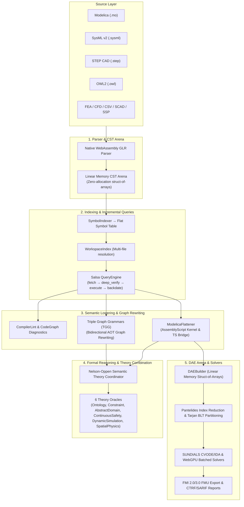

# Compiler Architecture Overview

ModelScript is an open-source, web-native polyglot compiler and multi-domain engineering intelligence platform. Designed to bridge the historical silos between system architecture, physical simulation, 3D CAD geometry, continuum analysis (FEA/CFD), and formal verification, ModelScript operates on a unified, high-performance **computable digital thread**.

---

## End-to-End Compilation Pipeline

The compilation pipeline transforms polyglot source code into low-level, high-efficiency representations in linear WebAssembly memory without intermediate AST object allocations.

---

## Key Architectural Principles

### 1. Data-Oriented Struct-of-Arrays (SoA) in Linear Memory

Traditional compilers instantiate millions of object-oriented AST nodes, leading to massive memory overhead, pointer chasing, and garbage collection pressure. ModelScript lowers expressions, equations, and statements directly from native WebAssembly parser buffers into `DAEBuilder` integer handles (`ExprId`, `EqId`, `VarId`) packed into contiguous typed arrays.

### 2. Zero-Allocation Incremental GLR Parsing

Grammars in `@modelscript/dsl` compile ahead-of-time to native WebAssembly GLR (Generalized LR) parsing engines. Tokens stream directly through linear memory, resolving ambiguous and non-deterministic grammar constructs without back-tracking allocations.

### 3. Demand-Driven Salsa Incremental Computation

All name resolution, component specialization, and inheritance hierarchies are governed by a Salsa-inspired query engine. Queries cache results and track fine-grained dependency edges:
$$\text{fetch} \longrightarrow \text{deep\_verify} \longrightarrow \text{execute} \longrightarrow \text{backdate}$$
Modifying a single parameter or equation re-evaluates only transitively invalidated DAE components.

### 4. Coordinated Nelson-Oppen Multi-Theory Solvers

Formal verification combines distinct formal domains (Description Logic, non-linear interval arithmetic, continuous zonotope reachability, and 3D CAD collision checks) through an extensible Nelson-Oppen theory coordinator using CDCL(T) case splitting.

### 5. N-Ary Computable Digital Thread Hypergraph

Unlike legacy point-to-point integrations or passive PLM metadata links, ModelScript connects all engineering domains through a linear-memory alignment hypergraph (`@modelscript/runtime/interop/thread_hypergraph`). Hyperedges link requirements (SysML v2), physical states (Modelica), 3D solid geometry (STEP), continuum patches (CFD/FEA), and domain ontologies (OWL2). The thread is _computable_: changes propagate automatically via TGG graph rewrite rules, physical states drive dynamic CAD transformations, and multi-theory oracles verify cross-domain contracts with cryptographically verifiable proof manifests.

---

## Monorepo Package Matrix

| Package                                                                                           | Workspace           | Role                                                                                               |
| :------------------------------------------------------------------------------------------------ | :------------------ | :------------------------------------------------------------------------------------------------- |
| [`@modelscript/dsl`](https://github.com/modelscript/modelscript/tree/main/packages/dsl)           | `packages/dsl`      | Grammar combinators, WASM GLR parser compiler (`buildParser`), TGG compiler, and E-graph rewriting |
| [`@modelscript/runtime`](https://github.com/modelscript/modelscript/tree/main/packages/runtime)   | `packages/runtime`  | `DAEBuilder`, linear memory CST arenas, Salsa `QueryEngine`, and Nelson-Oppen theory coordinator   |
| [`@modelscript/simulate`](https://github.com/modelscript/modelscript/tree/main/packages/simulate) | `packages/simulate` | SUNDIALS CVODE/IDA numerical integrators, WebGPU batched ODE solver, and surrogate ROM models      |
| [`@modelscript/lsp`](https://github.com/modelscript/modelscript/tree/main/packages/lsp)           | `packages/lsp`      | Multi-language Language Server Protocol server and background worker pool                          |
| [`@modelscript/diagram`](https://github.com/modelscript/modelscript/tree/main/packages/diagram)   | `packages/diagram`  | Polyglot diagram engine, auto-layout, and SVG rendering                                            |
| [`@modelscript/exchange`](https://github.com/modelscript/modelscript/tree/main/packages/exchange) | `packages/exchange` | FMI 2.0/3.0 FMU export/import and SSP container packaging                                          |
| [`@modelscript/cad`](https://github.com/modelscript/modelscript/tree/main/packages/cad)           | `packages/cad`      | CAD engine: CSG primitives, OpenCascade kernels, and STEP B-Rep parsing                            |
| [`@modelscript/mcp`](https://github.com/modelscript/modelscript/tree/main/packages/mcp)           | `packages/mcp`      | Model Context Protocol server exposing compiler and simulation tools to AI agents                  |
