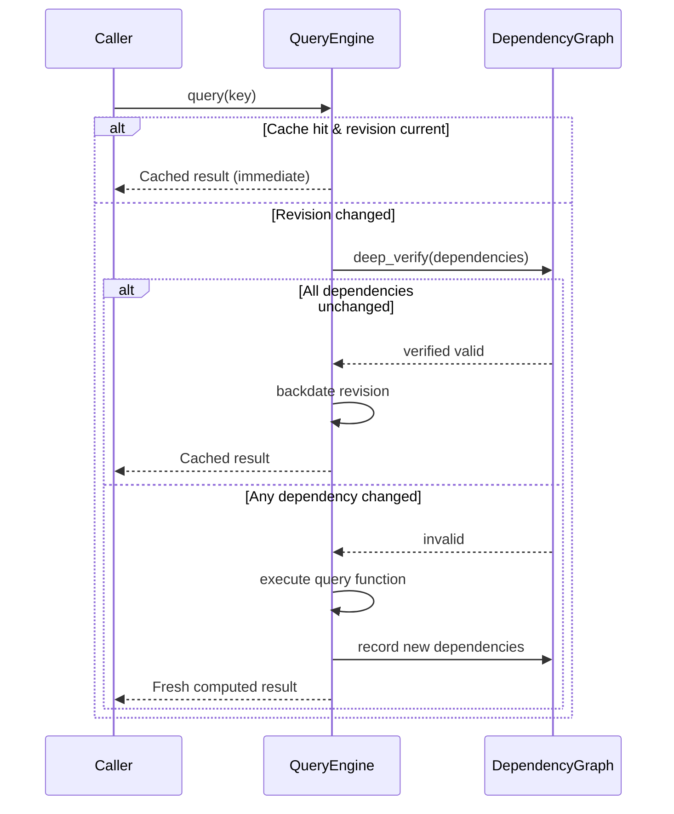

# Salsa Incremental Query Engine

ModelScript's semantic analysis and symbol resolution pipeline is driven by an incremental query computation engine inspired by the open-source [Salsa](https://github.com/salsa-rs/salsa) incremental query framework.

The engine lives in `@modelscript/runtime` and provides memoized, demand-driven evaluation across multi-file engineering workspaces.

---

## The Query Life Cycle

Every query executed in ModelScript follows a 4-phase lifecycle to ensure maximum cache re-use and correct invalidation:

### The 4 Stages

1. **`fetch`**: Checks if the query result exists in the memoization table.
2. **`deep_verify`**: If the workspace revision has advanced, transitively checks whether any input queries or files that contributed to this result have actually changed.
3. **`execute`**: Re-runs the query definition if inputs have genuinely changed, tracking any newly accessed queries.
4. **`backdate`**: If re-executing the query produces an output value identical to the previous result, the query's revision is backdated to prevent cascading invalidation down the dependency tree.

---

## Key Compiler Queries

The query engine handles semantic resolution, type checking, and specialization:

| Query                   | Scope     | Description                                                                             |
| :---------------------- | :-------- | :-------------------------------------------------------------------------------------- |
| `instantiate`           | Class     | Resolves all direct components, inherited elements, and nested declarations of a class. |
| `classInstance`         | Component | Specializes a generic class definition with specific modifier expressions.              |
| `resolveSimpleName`     | Scope     | Performs hierarchical lexical scoping and imports resolution.                           |
| `variability`           | Component | Computes effective variability: `constant`, `parameter`, `discrete`, or `continuous`.   |
| `causality`             | Component | Computes signal causality: `input`, `output`, or `internal`.                            |
| `effectiveModification` | Hierarchy | Resolves and merges class modification clauses across multi-level inheritance graphs.   |

---

## Salsa & Linear CST Synergy

AST wrapper nodes are **never** stored inside the Salsa cache. Storing heavy AST objects would duplicate memory and defeat garbage collection guarantees.

Instead:

- The Salsa cache stores semantic integer handles and primitive metadata (e.g. `SymbolId`, resolved `TypeInfo`, variability enums).
- Concrete CST nodes are retrieved on-demand from linear memory using `db.cstNode(symbolId)` only when lowering or evaluating equations.
