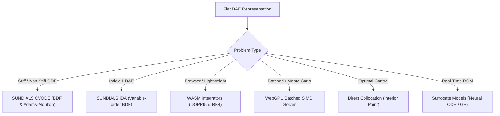

# Simulation Solvers & Numerical Integrators

ModelScript embeds a multi-tier suite of numerical solvers in `@modelscript/simulate` to support both desktop simulations and massive batched cloud/WebGPU parameter sweeps.

---

## Supported Solvers

---

## 1. SUNDIALS CVODE & IDA Integrators

For high-precision industrial models, ModelScript integrates Lawrence Livermore National Laboratory's **SUNDIALS** suite compiled to WebAssembly:

- **CVODE**: Solves Initial Value Problems (IVPs) for stiff and non-stiff systems of ordinary differential equations (ODEs). Uses Variable-Order Variable-Step-size Adams-Moulton methods for non-stiff systems and Backward Differentiation Formulas (BDF) for stiff systems.
- **IDA**: Solves Initial Value Problems for systems of differential-algebraic equations (DAEs) of index up to 1:
  $$F(t, y, y') = 0$$
  Includes dense and sparse linear solvers with adaptive step-size control.

---

## 2. WebGPU Batched Parallel Solvers

When performing Monte Carlo uncertainty analysis or hyperparameter sweeps, sequential simulation is a bottleneck.

ModelScript compiles linearized DAE blocks into WebGPU compute shaders (`@modelscript/simulate/gpu`):

- Runs thousands of parameter combinations in parallel on GPU hardware.
- Scales efficiently across client GPUs in browsers and headless datacenter instances.
- Returns statistical distributions, mean trajectories, and variance envelopes directly.

---

## 3. Direct Collocation Optimal Control

ModelScript formulates dynamic optimization and optimal control problems directly from Modelica models:

$$\min_{u(t)} \int_0^T L(x(t), u(t), t) \, dt$$
$$\text{subject to } F(t, x, \dot{x}, u) = 0, \quad u_{\min} \le u(t) \le u_{\max}$$

- **Transcription**: Transcribes the continuous system into non-linear programming (NLP) problems using Radau or Lobatto collocation points.
- **Solvers**: Solves the resulting sparse NLP using interior-point optimization techniques.

---

## 4. Surrogate Reduced Order Models (ROM)

High-fidelity 3D simulations (such as CFD or FEA) are often too computationally expensive for real-time control loops or web deployment.

ModelScript's surrogate modeling pipeline (`msx surrogate`):

1. **Sampling**: Generates experimental design samples (Latin Hypercube, Sobol sequences).
2. **Execution**: Evaluates high-fidelity runs across parameter spaces.
3. **Training**: Trains compact surrogate models using:
   - Polynomial Chaos Expansion (PCE)
   - Gaussian Process Regression (Kriging)
   - Neural Ordinary Differential Equations (Neural ODEs)
4. **Embedding**: Exports the trained surrogate as a standardized FMI Functional Mock-up Unit (FMU) or standalone WebAssembly module.
