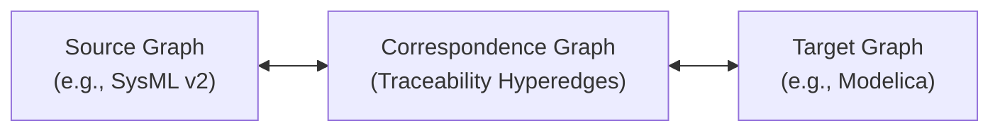

# Polyglot Triple Graph Grammars (TGG)

ModelScript provides declarative, ahead-of-time (AOT) compiled **Triple Graph Grammars (TGG)** and Double-Pushout (DPO) algebraic graph rewriting via `@modelscript/dsl/tgg`.

TGG serves as the foundational synchronization mechanism across the polyglot digital thread, enabling bidirectional transformations between disparate engineering models (such as architectural SysML v2 specifications and 1D Modelica physical simulations).

---

## What is a Triple Graph Grammar?

A Triple Graph Grammar synchronizes three distinct graphs:



- **Source Graph ($G_S$)**: Represents domain concepts in the source language (e.g. SysML v2 Part Definitions, Ports, Requirements).
- **Target Graph ($G_T$)**: Represents concepts in the target language (e.g. Modelica Models, Connectors, Equations).
- **Correspondence Graph ($G_C$)**: Explicitly records semantic trace links between elements in the source and target models.

Rather than writing ad-hoc imperative glue code, engineers write declarative rules specifying how elements correspond.

---

## Declarative TGG Rules

A TGG rule specifies patterns in the source, correspondence, and target graphs simultaneously:

```typescript
import { tggRule } from "@modelscript/dsl/tgg";

export const ComponentToModel = tggRule({
  name: "ComponentToModel",
  source: (s) => ({
    part: s.node("PartUsage", { name: s.var("compName") }),
    port: s.node("PortUsage", { parent: s.nodeRef("part") }),
  }),
  target: (t) => ({
    model: t.node("ModelDefinition", { name: t.var("compName") }),
    pin: t.node("PinConnector", { parent: t.nodeRef("model") }),
  }),
  correspondence: (c) => ({
    tracePart: c.link("part", "model"),
    tracePort: c.link("port", "pin"),
  }),
});
```

---

## AOT Compilation to WebAssembly

Unlike interpreted graph transformation engines, `@modelscript/dsl/tgg` compiles rules into deterministic AssemblyScript dispatch routines executing directly in WebAssembly:

- `tgg_forward_dispatch`: Incremental forward propagation from source changes to target models.
- `tgg_backward_dispatch`: Reverse propagation of parameter sizing or component changes back to architectural definitions.
- `tgg_propagate_all_stale`: High-throughput batch reconciliation across dirty workspace subgraphs.

---

## Critical Pair Analysis (CPA)

A notorious problem in graph transformation is rule conflict and non-determinism. ModelScript includes an automated **Critical Pair Analysis (CPA)** verification pass:

1. **Confluence Verification**: Analyzes whether overlapping rule applications could cause divergent target states.
2. **Termination Guarantees**: Proves that cyclic dependencies cannot cause infinite rewrite loops during synchronization.
3. **Completeness Checking**: Flags unmapped source elements that lack corresponding target constructors.
