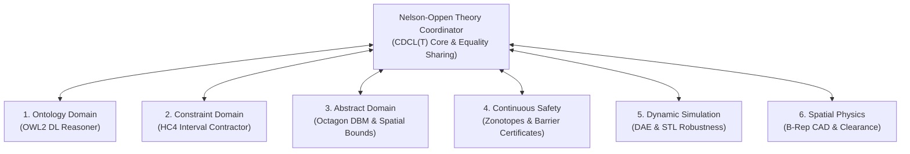

# Nelson-Oppen Semantic Theory Coordinator

Cross-domain engineering verification requires proving invariants that span discrete taxonomies, non-linear physical dynamics, spatial CAD envelopes, and numerical constraints simultaneously across the **computable digital thread**.

ModelScript solves this through a generalized **Nelson-Oppen Semantic Theory Coordinator** (`@modelscript/runtime/formal/theory_coordinator`).

---

## Theory Combination Architecture

The Nelson-Oppen framework orchestrates signature-disjoint theory solvers. Each solver operates on its specific domain algebra while communicating variable equalities, numeric interval bounds, and conflict clauses via a shared CDCL(T) coordinator:



---

## The 6 Domain Theory Oracles

### 1. Ontology Domain (`OntologyTheoryOracle`)

- **Underlying Logic**: Description Logic (DL) tableau reasoner.
- **Capabilities**: OWL2 taxonomy reasoning, concept classification, concept subsumption ($C \sqsubseteq D$), and scoped disjointness.
- **Verification Role**: Ensures components conform to standardized ontology definitions (e.g. confirming a redundant actuator cannot share a single power bus).

### 2. Constraint Domain (`ConstraintTheoryOracle`)

- **Underlying Logic**: DPLL(T) arithmetic solver with non-linear interval arithmetic.
- **Capabilities**: HC4 constraint propagation and box consistency.
- **Verification Role**: Enforces algebraic inequality bounds ($u_{\min} \le u(t) \le u_{\max}$) and parameter limits.

### 3. Abstract Domain (`AbstractDomainOracle`)

- **Underlying Logic**: Abstract interpretation over numerical domains.
- **Capabilities**: Octagon Difference Bound Matrices ($\pm x_i \pm x_j \le c$) and 4D spatio-temporal bounding boxes.
- **Verification Role**: Efficiently bounds state spaces without expensive simulation.

### 4. Continuous Safety Domain (`ContinuousSafetyOracle`)

- **Underlying Logic**: Formal reachability analysis and Lyapunov barrier certificates.
- **Capabilities**: Constrained zonotopes, star sets, and Sum-of-Squares (SOS) polynomial optimization.
- **Verification Role**: Proves that continuous ODE/DAE trajectories never enter unsafe sets under uncertain initial conditions.

### 5. Dynamic Simulation Domain (`DynamicSimulationOracle`)

- **Underlying Logic**: High-order numerical DAE trajectory integration.
- **Capabilities**: Evaluates Signal Temporal Logic (STL) formulas ($\square_{[0, T]} (\text{speed} < 120)$) and computes quantitative robustness degrees.
- **Verification Role**: Validates complex dynamic behaviors that exceed purely symbolic verification.

### 6. Spatial Physics Domain (`SpatialPhysicsOracle`)

- **Underlying Logic**: Exact boundary representation (B-Rep) 3D CAD analysis.
- **Capabilities**: Watertight solid boolean collision checks, clearance verification, center of mass, and moment of inertia extraction.
- **Verification Role**: Ensures physical components physically fit inside their geometric enclosures without interference.

---

## Verification Workflow Example

To prove an end-to-end requirement:

```bash
npx msc verify SystemRequirement model.mo --sysml architecture.sysml --cad chassis.step
```

1. **System Architecture** is ingested from SysML v2.
2. **Physical Dynamics** are simulated and bounded from Modelica.
3. **Clearance Limits** are verified against the STEP CAD solid.
4. If a conflict arises, the Theory Coordinator computes an **interpolant lemma** or minimal unsatisfiable core (Unsat Core) explaining the root cause.
