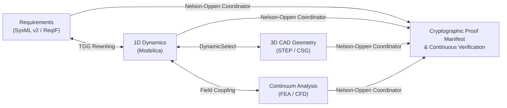

# Introduction

Welcome to **ModelScript**, the open-source **computable digital thread** platform and polyglot compiler designed for modern multi-domain engineering.

---

## What is the Computable Digital Thread?

Modern complex systems — from electric vehicles and aerospace systems to industrial robotics — require seamless coordination across disparate engineering domains:

- **System Architecture & Requirements** (SysML v2, KerML, ReqIF)
- **1D Multi-Domain Physical Simulation** (Modelica 3.x, SSP)
- **3D CAD Geometry & Envelopes** (STEP ISO 10303, OpenSCAD CSG)
- **Continuum Field Physics** (FEA structural stress, CFD aerodynamics)
- **Ontological Taxonomies & Rules** (OWL2 Functional Syntax)

Traditionally, these disciplines operate in disconnected silos. Enterprise "digital threads" have historically been **passive and descriptive** — composed of static document links, slow PLM databases, and manual spreadsheets that fall out of sync the moment a parameter changes.

**ModelScript makes the digital thread _computable_.**

Instead of passive hyperlinks, ModelScript treats engineering models as **executable, code-first specifications** evaluated continuously by native WebAssembly compilers, graph rewriting engines, and formal solvers:

---

## Core Pillars of ModelScript

### 1. Code-First Engineering Models

Every artifact lives as clean, text-based code versioned in Git. Say goodbye to proprietary binary files and monolithic GUI databases. Diff, review, merge, and test engineering models using standard modern developer workflows and CI/CD pipelines.

### 2. High-Performance WebAssembly CST & DAE Arenas

Powered by ahead-of-time generated WebAssembly GLR incremental parsers and a zero-allocation Struct-of-Arrays (SoA) linear memory architecture (`DAEBuilder`). Hierarchical models flatten into Differential Algebraic Equations with zero garbage collection pause, enabling microsecond cycle times inside IDEs and web browsers.

### 3. Bidirectional Triple Graph Grammars (TGG)

Keep architecture and physics in permanent alignment. Declarative TGG rules compile into AOT WebAssembly dispatch tables that automatically propagate architectural changes (SysML v2) forward into physical simulation models (Modelica), while back-annotating numerical simulation sizing results back into architectural specifications.

### 4. Nelson-Oppen Multi-Theory Formal Verification

Cross-domain verification is solved through an extensible Nelson-Oppen theory coordinator. Exchange equality facts and conflict clauses across six signature-disjoint theory oracles — Ontology (OWL2), Interval Constraints, Abstract Interpretation, Continuous Reachability (Zonotopes), Dynamic DAE Simulation, and 3D Spatial CAD clearance.

### 5. Multi-Language Language Server Protocol (LSP)

A unified background worker indexing mixed-language workspaces simultaneously. Enjoy instant go-to-definition, hover documentation, semantic completion, and real-time compiler diagnostics across Modelica, SysML v2, STEP, and OWL2 in VS Code or browser environments.

---

## Ready to Get Started?

Proceed to the [Installation guide](./installation.md) to set up the `msx` CLI and VS Code extension, or follow [Getting Started](./getting-started.md) to build your first connected model.
