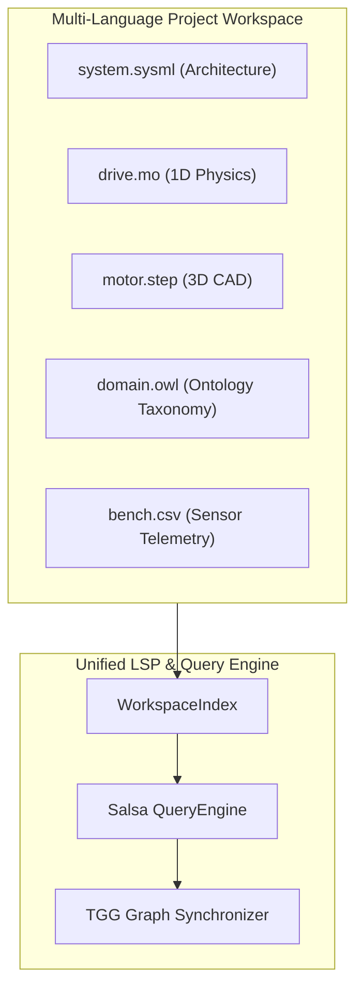

# Polyglot Engineering Languages

ModelScript breaks down domain silos by providing first-class compiler and language server support for nine engineering languages. Every language features a native WebAssembly GLR incremental parser, shared CST arenas, and unified semantic queries.

---

## Language Support Matrix

| Language     | Directory            | Standard / Dialect       | Primary Domain                      | Parser Technology        |
| :----------- | :------------------- | :----------------------- | :---------------------------------- | :----------------------- |
| **Modelica** | `languages/modelica` | Modelica 3.x             | 1D Multi-Domain Physical Simulation | WASM GLR (`parser.wasm`) |
| **SysML v2** | `languages/sysml2`   | SysML v2 / KerML         | Systems Architecture & Requirements | WASM GLR (`parser.wasm`) |
| **STEP**     | `languages/step`     | ISO 10303-21/203/214/242 | 3D CAD B-Rep Product Data           | WASM GLR (`parser.wasm`) |
| **OWL2**     | `languages/owl2`     | OWL 2 Functional-Style   | Ontological Knowledge & Taxonomies  | WASM GLR (`parser.wasm`) |
| **CSV**      | `languages/csv`      | RFC 4180 / Sensor CSV    | Telemetry & Calibration Datasets    | WASM GLR (`parser.wasm`) |
| **CFD**      | `languages/cfd`      | SU2 / OpenFOAM dialects  | Fluid Dynamics & Flow Boundaries    | WASM GLR (`parser.wasm`) |
| **FEA**      | `languages/fea`      | Nastran / Code_Aster     | Structural Stress & Finite Elements | WASM GLR (`parser.wasm`) |
| **OpenSCAD** | `languages/scad`     | OpenSCAD CSG             | Programmatic 3D Solid Geometry      | WASM GLR (`parser.wasm`) |
| **SSP**      | `languages/ssp`      | Modelica Assoc. SSP 1.0  | Co-Simulation System Packaging      | WASM GLR / XML Parser    |

---

## Unified Multi-Language Indexing

All languages share a unified symbol indexing interface defined in `@modelscript/dsl`:

- **Flat Symbol Storage**: Every declaration is assigned a unique `SymbolId` and stored in a flat table with byte offsets back to source.
- **Cross-Language References**: A SysML v2 component can directly reference a Modelica simulation model or STEP CAD file using URI identifiers.
- **Single Workspace Index**: The Language Server Protocol (LSP) indexes mixed-language workspaces simultaneously, enabling cross-language go-to-definition, hover documentation, and rename refactorings.

