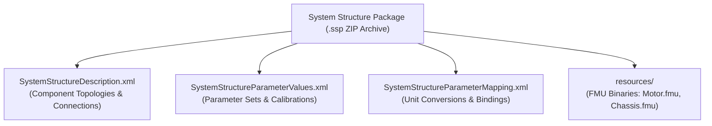

# System Structure & Parameterization (SSP)

ModelScript provides full support for the Modelica Association standard **System Structure and Parameterization (SSP 1.0)** under `languages/ssp/` and `@modelscript/exchange`.

---

## What is SSP?

SSP defines a standardized, tool-independent format for packaging complete simulation systems composed of multiple interconnected Functional Mock-up Units (FMUs), parameters, and signal dictionaries.

---

## Core Capabilities

- **SSP Archive Packaging & Unpacking**: Creates and unpacks standardized `.ssp` ZIP archives containing multiple FMUs and metadata.
- **Topological Connection Resolution**: Validates input-output signal compatibility across connected FMUs.
- **Unit Conversion & Signal Mappings**: Evaluates linear scale and offset transformations across connected ports ($y = a \cdot u + b$).
- **Co-Simulation Orchestration**: Drives co-simulation master algorithms across all bundled FMUs with adaptive communication step sizes.
