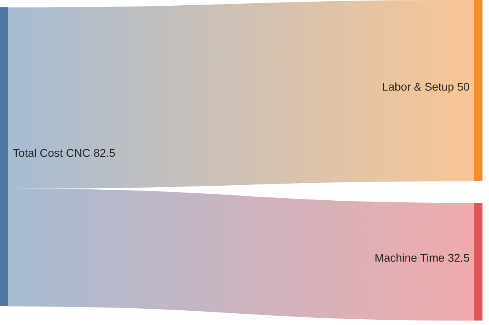

# Dynamic Manufacturing Visualizations

```mermaid
gantt
    title Drone Chassis Manufacturing Lead Time (Dynamic)
    dateFormat m
    axisFormat %H:%M

    section CNC Machining (Option B)
    Machine Setup ($50.00) :a1, 0, 30m
    Active Milling ($32.50) :a2, after a1, 0m

    section FDM 3D Printing (Option A)
    Bed Prep & Heat ($1.25) :b1, 0, 5m
    Active Printing ($0.01) :b2, after b1, 0m
```

```mermaid
sankey-beta
    Total Cost CNC, Labor & Setup, 50.00
    Total Cost CNC, Machine Time, 32.50
```
