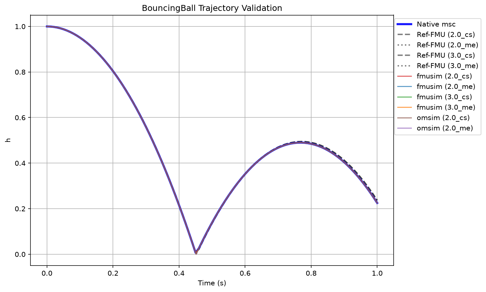
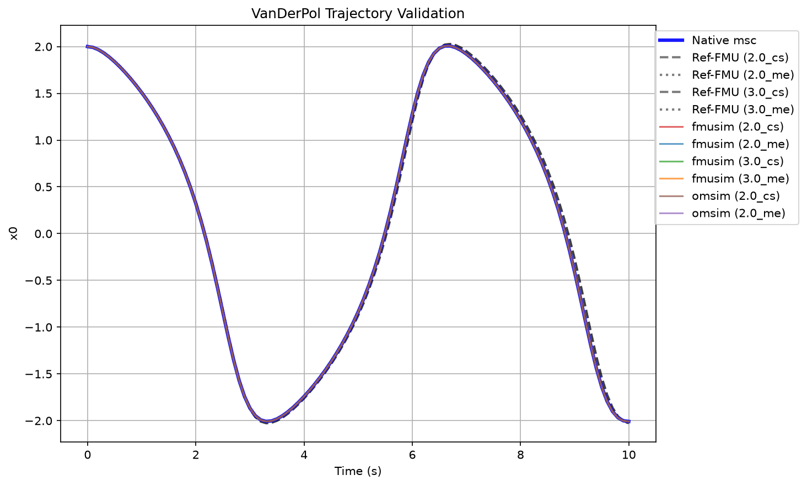
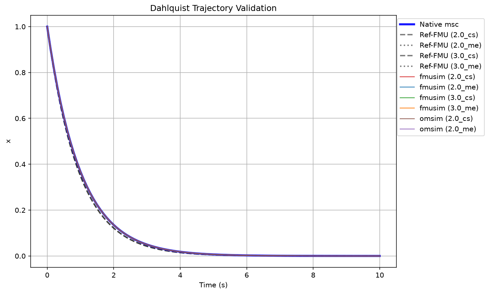
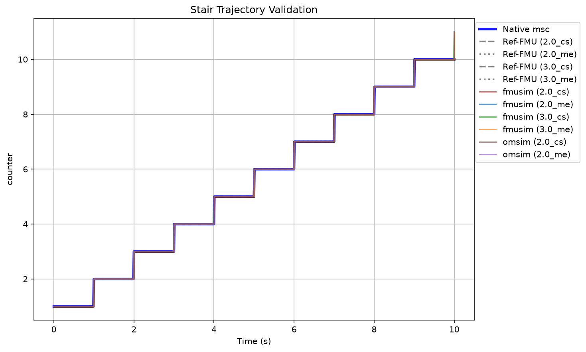
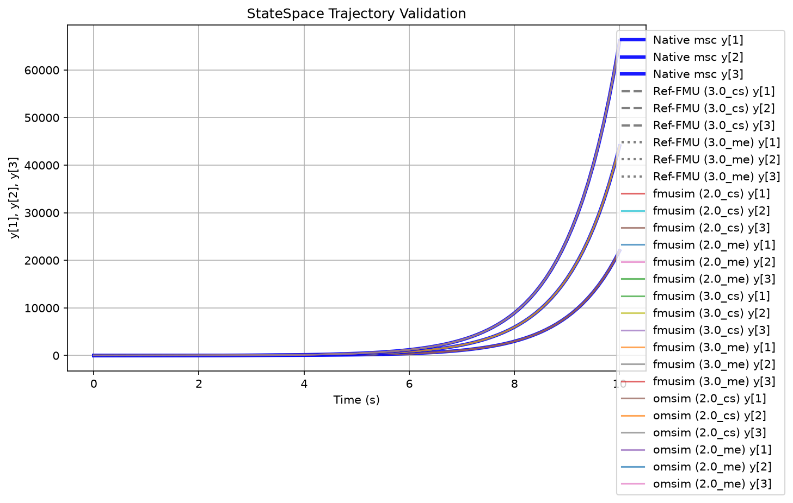

# ModelScript FMI Validation Dashboard

This dashboard tracks the numerical parity and structural compatibility of the ModelScript FMI exporter across FMI 2.0 & FMI 3.0 (ME and CS) against the official [Modelica Reference-FMUs](https://github.com/modelica/Reference-FMUs). The Reference-FMUs are compiled directly from their manual C source code via their provided CMake build system, serving as the definitive ground truth for these validation benchmarks.

### Options & Terminology

- **Native msc:** The ModelScript Arena Simulator running the source `.mo` file directly. Uses the internal WASM CVODE solver by default.
- **msc-FMU (fmusim):** The exported ModelScript FMU (`.fmu`) simulated using the official FMI standard `fmusim` C-binary. We explicitly pass `--output-interval` to ensure exact parity with the Reference FMU execution.
  - **Model Exchange (ME):** The FMU only supplies state derivatives. The host (`fmusim`) integrates the equations. We explicitly configure `fmusim` to use the **CVODE** algorithm (`--solver cvode`).
  - **Co-Simulation (CS):** The FMU contains its own embedded solver. ModelScript natively compiles a custom **4th-order Runge-Kutta (RK4)** integration algorithm directly into the FMU binary to advance the state.
- **msc-FMU (omsim):** The exported ModelScript FMU (`.fmu`) simulated using OpenModelica's `OMSimulator` binary (which also utilizes CVODE/KINSOL algorithms internally).

### Error Metric

Values are reported as `Max Absolute Error (NRMSE %)`. A simulation passes if the max absolute error is tiny (< 1.0) or the Normalized Root Mean Square Error (NRMSE) is under 5%.

### Expected Exclusions & Failures

- **Done (No Ref):** Indicates the simulation succeeded internally, but no Ground Truth Reference-FMU exists for this FMI version (e.g. `StateSpace` is not available in FMI 2.0 reference FMUs).
- **OMSimulator FMI 3.0 Failures:** `OMSimulator` v2.1.3 explicitly hardcodes schema validation to the `FMI-2.0` standard. FMI 3.0 FMUs fail during ingestion because the `fmiVersion="3.0"` attribute does not match the hardcoded `#FIXED` value of `'2.0'`. This is a limitation of the current OMSimulator build.

## Simulation Matrix

| Model        | FMI | Mode | Native msc        | msc-FMU (fmusim)  | msc-FMU (omsim)   |
| ------------ | --- | ---- | ----------------- | ----------------- | ----------------- |
| BouncingBall | 2.0 | CS   | ✅ 2.5e-2 (0.45%) | ✅ 2.5e-2 (0.45%) | ✅ 2.5e-2 (0.45%) |
| BouncingBall | 2.0 | ME   | ✅ 2.7e-4 (0.01%) | ✅ 5.3e-5 (0.00%) | ✅ 2.3e-4 (0.01%) |
| BouncingBall | 3.0 | CS   | ✅ 2.5e-2 (0.45%) | ✅ 2.5e-2 (0.45%) | Not Supported     |
| BouncingBall | 3.0 | ME   | ✅ 2.7e-4 (0.01%) | ✅ 5.3e-5 (0.00%) | Not Supported     |
| VanDerPol    | 2.0 | CS   | ✅ 2.8e-1 (1.43%) | ✅ 2.8e-1 (1.43%) | ✅ 2.8e-1 (1.43%) |
| VanDerPol    | 2.0 | ME   | ✅ 3.0e-3 (0.02%) | ✅ 0.0e+0 (0.00%) | ✅ 3.0e-3 (0.02%) |
| VanDerPol    | 3.0 | CS   | ✅ 2.8e-1 (1.43%) | ✅ 2.8e-1 (1.43%) | Not Supported     |
| VanDerPol    | 3.0 | ME   | ✅ 3.0e-3 (0.02%) | ✅ 0.0e+0 (0.00%) | Not Supported     |
| Dahlquist    | 2.0 | CS   | ✅ 1.9e-2 (0.81%) | ✅ 1.9e-2 (0.81%) | ✅ 1.9e-2 (0.81%) |
| Dahlquist    | 2.0 | ME   | ✅ 2.5e-4 (0.01%) | ✅ 0.0e+0 (0.00%) | ✅ 3.9e-4 (0.02%) |
| Dahlquist    | 3.0 | CS   | ✅ 1.9e-2 (0.81%) | ✅ 1.9e-2 (0.81%) | Not Supported     |
| Dahlquist    | 3.0 | ME   | ✅ 2.5e-4 (0.01%) | ✅ 0.0e+0 (0.00%) | Not Supported     |
| Stair        | 2.0 | CS   | ✅ 1.0e+0 (0.98%) | ✅ 1.0e+0 (0.74%) | ✅ 1.0e+0 (0.64%) |
| Stair        | 2.0 | ME   | ✅ 1.0e+0 (0.98%) | ✅ 0.0e+0 (0.00%) | ✅ 0.0e+0 (0.00%) |
| Stair        | 3.0 | CS   | ✅ 1.0e+0 (0.98%) | ✅ 0.0e+0 (0.00%) | Not Supported     |
| Stair        | 3.0 | ME   | ✅ 1.0e+0 (0.98%) | ✅ 0.0e+0 (0.00%) | Not Supported     |
| StateSpace   | 2.0 | CS   | Done (No Ref)     | Done (No Ref)     | Done (No Ref)     |
| StateSpace   | 2.0 | ME   | Done (No Ref)     | Done (No Ref)     | Done (No Ref)     |
| StateSpace   | 3.0 | CS   | ✅ 3.3e+2 (0.11%) | ✅ 3.3e+2 (0.11%) | Not Supported     |
| StateSpace   | 3.0 | ME   | ✅ 8.2e+1 (0.03%) | ✅ 0.0e+0 (0.00%) | Not Supported     |

## Models & Validation Plots

### BouncingBall

**Simulation Options:** `stopTime = 1`, `stepSize / outputInterval = 0.01`, `Native Solver = cvode`

<details>
<summary><b>Source Code (BouncingBall.mo)</b></summary>

```modelica
model BouncingBall     "The bouncing ball model"
  Real g(start = -9.81);
  parameter Real e = 0.7;   // Elasticity constant of ball
  parameter Real v_min = 0.1;
  Real h(start = 1);        // height above ground
  Real v(start = 0);        // Velocity of the ball
equation
  der(h) = v;
  der(v) = g;
  der(g) = 0;

  when h <= 0 and v < 0 and -e*pre(v) >= v_min then
    reinit(v, -e*pre(v));
  end when;

  when h <= 0 and v < 0 and -e*pre(v) < v_min then
    reinit(v, 0);
    reinit(g, 0);
  end when;


end BouncingBall;
```

</details>



### VanDerPol

**Simulation Options:** `stopTime = 10`, `stepSize / outputInterval = 0.1`, `Native Solver = cvode`

<details>
<summary><b>Source Code (VanDerPol.mo)</b></summary>

```modelica
model VanDerPol  "Van der Pol oscillator model"
  Real x(start = 2);
  Real y(start = 0);
  parameter Real mu = 1.0;
equation
  der(x) = y;
  der(y) = - x + mu*(1 - x*x)*y;

end VanDerPol;
```

</details>



### Dahlquist

**Simulation Options:** `stopTime = 10`, `stepSize / outputInterval = 0.1`, `Native Solver = cvode`

<details>
<summary><b>Source Code (Dahlquist.mo)</b></summary>

```modelica
model Dahlquist
  parameter Real k = 1.0;
  Real x(start=1.0);
equation
  der(x) = -k * x;
end Dahlquist;
```

</details>



### Stair

**Simulation Options:** `stopTime = 10`, `stepSize / outputInterval = 0.01`, `Native Solver = cvode`

<details>
<summary><b>Source Code (Stair.mo)</b></summary>

```modelica
model Stair
  Integer counter(start=1);
equation
  when time >= counter then
    counter = pre(counter) + 1;
  end when;
end Stair;
```

</details>



### StateSpace

**Simulation Options:** `stopTime = 10`, `stepSize / outputInterval = 0.1`, `Native Solver = cvode`

<details>
<summary><b>Source Code (StateSpace.mo)</b></summary>

```modelica
model StateSpace
  parameter Integer m = 3;
  parameter Integer n = 3;
  parameter Integer r = 3;

  parameter Real A[n, n] = [1, 0, 0; 0, 1, 0; 0, 0, 1];
  parameter Real B[n, m] = [1, 0, 0; 0, 1, 0; 0, 0, 1];
  parameter Real C[r, n] = [1, 0, 0; 0, 1, 0; 0, 0, 1];
  parameter Real D[r, m] = [1, 0, 0; 0, 1, 0; 0, 0, 1];
  parameter Real x0[n] = {0, 0, 0};
  Real u[m] = {1, 2, 3};
  output Real y[r];

  Real x[n](start=x0);
equation
  for i in 1:n loop
    der(x[i]) = A[i,1]*x[1] + A[i,2]*x[2] + A[i,3]*x[3] + B[i,1]*u[1] + B[i,2]*u[2] + B[i,3]*u[3];
    y[i] = C[i,1]*x[1] + C[i,2]*x[2] + C[i,3]*x[3] + D[i,1]*u[1] + D[i,2]*u[2] + D[i,3]*u[3];
  end for;
end StateSpace;
```

</details>


